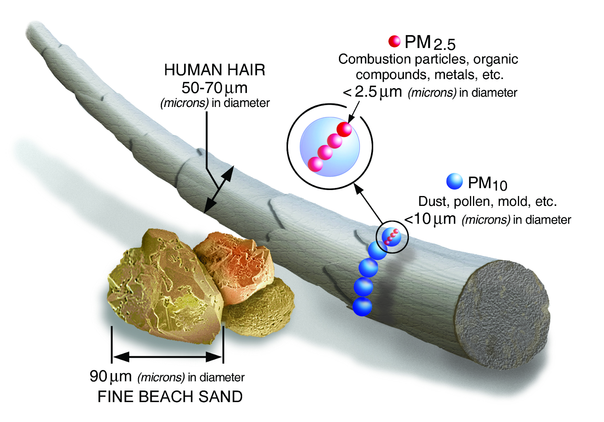
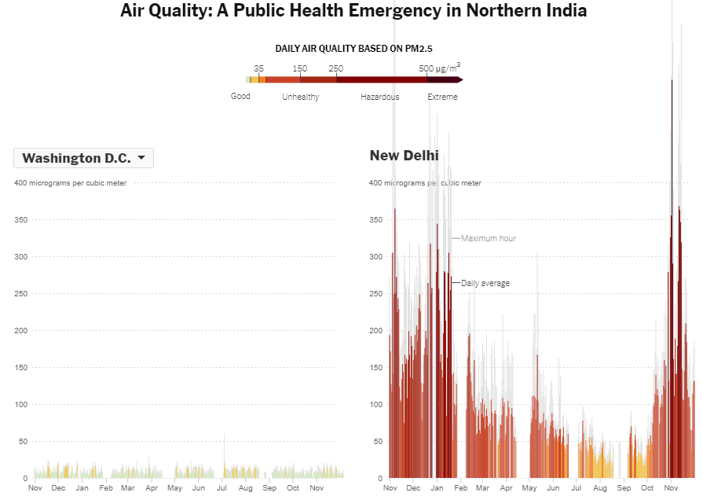
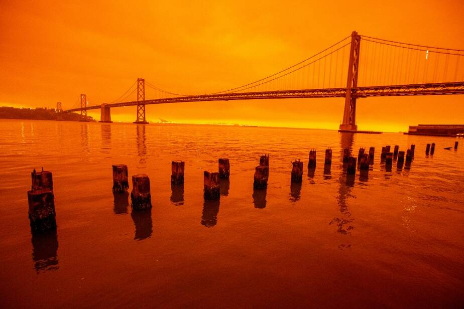

# Energy

What is energy? Scientists define energy as the ability to do work. In practice, energy makes _everything_ happen. To set the scene, let's watch this video from TED-Ed where Joshua M. Sneideman describes all things energy, from energy budget to how energy is used on earth to various energy sources.

<iframe width="560" height="315" src="https://www.youtube-nocookie.com/embed/fHztd6k5ZXY" frameborder="0" allow="accelerometer; autoplay; clipboard-write; encrypted-media; gyroscope; picture-in-picture" allowfullscreen></iframe>

## Energy sources

Let's learn about each of these energy sources in more depth! **Non-renewable** energy sources are in limited supply, while **renewable** energy sources are endlessly at our disposal.

### Non-renewable energy sources

**Coal energy** refers to burning coal (a shiny, black rock) in a power plant to generate heat and electricity. The coal we use today was formed hundreds of millions of years ago—even before the dinosaurs! Back then, Earth was covered by huge swamps filled with ferns and plants. As the plants died, they sank to the bottom of the swamps, packed down by dirt and water and stored underground as carbon. Over time, this heat and pressure turned plants into coal.

Coal is one of the most popular energy sources to date because it has been cheap to produce. Since coal takes millions of years to form, it's **non-renewable** because we can't easily create more. Though there is enough coal in the United States to last between 180 and 250 years, burning it can pollute our air, releasing CO2 that increases the effect of global warming. Keeping coal in the ground is one way to reduce greenhouse gas emissions.

**Natural gas** is an invisible mixture of gases that we can burn to create energy. Like coal, natural gas was formed in the Earth long ago. Sand covered dead plants and animals that sank to the bottom, and layers built up over time as sedimentary rock. Heat from the Earth and pressure from the rock layers turned plant and animal remains into natural gas and petroleum as pockets in the rock. Ever wondered why coal, oil, and natural gas are called **fossil fuels**? They're made from plant and animal fossils!

Today, we harness this energy through fracking. Let's check out this infographic to learn about what exactly fracking is.

- [What's the deal with fracking?](https://www.instagram.com/p/CGa4oOFphaY/), @climateduteam on Instagram

Natural gas is the cleanest fossil fuel since it doesn’t pollute the air as much as coal or oil. However, burning natural gas still releases copious amounts of greenhouse gases like CO2 and methane.

Although we've relied primarily on fossil fuels for electricity since the Industrial Revolution, it's time to transition away from them as quickly as possible. Carefully read through this explainer from the Union of Concerned Scientists which details the true costs of using coal, oil, and gas to power our planet.

- [The hidden costs of fossil fuels](https://www.ucsusa.org/resources/hidden-costs-fossil-fuels#:~:text=Burning%20fossil%20fuels%20emits%20a,formation%20of%20harmful%20particulate%20matter.), Union of Concerned Scientists

**Q: Which disastrous impact did you find most alarming? Tell a story about it below, as if you were telling a friend or family member.**

<textarea placeholder="Preview submission area. Answers are not saved."></textarea>

**Nuclear energy** harnesses energy stored in the nuclei of atoms. We set this energy free using two main methods: fusion and fission. With **fusion**, atoms are combined to make a new atom. For example, the sun's energy comes from fusion. Inside the sun, small hydrogen atoms combine to make larger helium atoms. However, since helium atoms require less energy to be held together, the extra energy is released as light and heat.

With **fission**, one atom is split into two smaller atoms, releasing extra energy as heat and radiation. Usually, we create nuclear energy by splitting uranium atoms. Since uranium is a mineral found in the ground and there's a limited supply, it's **nonrenewable**. However, nuclear energy is also considered to be one of the most environmentally-friendly nonrenewable energy sources since it doesn't emit greenhouse gases the way fossil fuels do.

What do you think of when you hear the words "nuclear power"? For many, Fukushima and Chernobyl come to mind. Nuclear power has received a pretty bad rap, and for good reason. During fission, heat isn’t the only energy that is released. Radiation is also released and can be dangerous in large amounts, potentially killing our cells and poisoning our food and water. No matter how safe the engineered technologies become, these nuclear scientists must fight the harmful first impressions left from decades past. Watch this Climate Lab video from Vox and the University of California about "the fight to rethink (and reinvent) nuclear power" with newer, safer nuclear technologies.

<iframe width="560" height="315" src="https://www.youtube-nocookie.com/embed/poPLSgbSO6k" frameborder="0" allow="accelerometer; autoplay; clipboard-write; encrypted-media; gyroscope; picture-in-picture" allowfullscreen></iframe>

**Q: How do you feel about shifting to nuclear energy as a climate solution? Do you trust the up-and-coming technology?**

<textarea placeholder="Preview submission area. Answers are not saved."></textarea>

### Renewable energy sources

**Hydropower** refers to energy we generate using moving water, using either water wheels and dams. **Water wheels** have buckets or boards around a big wheel that turns with the weight of water. **Dams** are usually built across a river, stopping water flow to create a **reservoir** behind the dam. When gates in the dam are opened, water flows down big pipes called penstocks and turns giant turbines, which power generators to make electricity. Since we'll never run out of water, hydropower is a **renewable** energy source.

**Wind** is moving air caused by the uneven heating of Earth’s surface. When the sun shines, some parts of the Earth absorb more solar energy than others. The equator is generally much warmer than the poles because it receives more consistent sunlight that turns into heat. As air warms, it expands and becomes less dense than the cooler air, rising above into the atmosphere. Cooler, denser air nearby flows in to take its place. Today, we use **wind turbines** to capture the wind. When the wind blows, it spins the blades of the wind turbines which turn a generator to make electricity. Wind is a clean, **renewable** energy source—as long as the sun shines, there will be winds on the Earth.

**Solar energy** harnesses energy that travels from the sun to the Earth in rays. Most of the energy goes off into space and only a small part reaches the Earth, but this amount is large enough to provide energy for life on earth. Sunlight turns into heat when it hits things—without the sun, the Earth would be uninhabitable. It would be too cold! Plants and phytoplankton use photosynthesis to "eat" sunlight, and they power the rest of the food chain. Sunlight even makes rain fall and wind blow, which power hydro and wind energy. Even coal, oil, and natural gas were made from prehistoric plants and animals that used sunlight for life.

Solar energy is free, clean, and **renewable**, but the challenge lies in capturing the sunlight since sunlight is spread all over the Earth instead of concentrating in one place. On a cloudy day, most of the light never reaches the ground at all. One way to capture the sunlight is by using solar panels, turn the sunlight into heat that can then be used for electricity. Curious to know more about how solar panels work? Let's watch this video from TED-Ed, where Richard Komp describes the inner workings of these big blue rectangles.

<iframe width="560" height="315" src="https://www.youtube-nocookie.com/embed/xKxrkht7CpY" frameborder="0" allow="accelerometer; autoplay; clipboard-write; encrypted-media; gyroscope; picture-in-picture" allowfullscreen></iframe>

**Geothermal energy** uses heat that comes from deep inside the Earth. When magma from the Earth's mantle comes close to the surface, it heats the water underground, creating hot water and steam that we can pump of the ground from geothermal wells. This steam spins then turbines with magnets in coils of copper wire to make electricity in power plants. Geothermal energy is a clean and **renewable** energy, since the steam is turned into water and put back into the Earth.

**Biomass** refers to anything that is alive or was alive a short time ago, such as trees, crops, garbage and animal waste. Most of the biomass we use for energy today is wood, which we burn to make heat. Biomass gets its energy from the sun, as plants store the sun’s energy in their leaves and roots. When we eat biomass, we use the energy to move and grow. Biomass can be used to make electricity through burning our garbage at waste-to-energy plants instead of sending it to a landfill, or producing **biogas** (which can be burned like natural gas) from organic matter like agricultural waste, food waste, and even sewage. Although biomass is **renewable** since we can easily plant and grow, we pollute the air when burning it. After all, it's burning waste!

**Q: Pick one of the mentioned energy sources and dig a little deeper. What are its pros and cons? Or, investigate online for another energy source that hasn't been mentioned yet. There are some weird ones out there!**

<textarea placeholder="Preview submission area. Answers are not saved."></textarea>

## Air pollution

Have you ever thought about how climate change can affect the air you breathe?

In fact, when climate change causes more wildfires or more forests being cleared for agriculture, more smoke enters the atmosphere. This increases the concentration of tiny particulates in the air. Also known as PM 2.5, meaning particulate matter with a diameter of 2.5 μm, these tiny particles are much, much smaller than the diameter of a human hair.

<figcaption><a href="https://www.epa.gov/pm-pollution/particulate-matter-pm-basics" target="_blank" rel="noopener">Particulate Matter (PM) Basics | Particulate Matter (PM)</a> by the EPA</figcaption>

These particles can aggravate many respiratory health problems like asthma by irritating your eyes, nose, throat, and lungs. Over time, repeated exposure to high concentrations can cause other health issues like heart disease, lung cancer, chronic bronchitis, and more. This is yet another example of how climate change can have negative impacts on human health.

So where are some sources of these harmful particulates? The most common are the burning of fossil fuels like coal, the combustion of gasoline in vehicles, the smoke emitted from industrial factories, and smoke from wildfires. Air quality varies widely across the world among different regions of the world.

How do the world's most polluted cities compare with yours? Explore the visualizations of pollutant concentration with this New York Times interactive.

- [See How the World’s Most Polluted Air Compares With Your City’s](https://www.nytimes.com/interactive/2019/12/02/climate/air-pollution-compare-ar-ul.html), NYT interactive article

<figcaption>A comparison of the air quality in Washington, D.C., to the air quality in New Delhi, India. (Source: <a href="https://www.nytimes.com/interactive/2019/12/02/climate/air-pollution-compare-ar-ul.html" target="_blank" rel="noopener">New York Times</a>)</figcaption>

Regions that are more industrialized and developed tend to have the worst air quality, even in more developed places that dedicate time and energy to battling air pollution. For example, in the United States, wildfires in California have worsened air quality to hazardous levels and caused skies to change color

<figcaption>The 2020 wildfires turned the skies a bright orange in San Francisco. Credit: Ray Chavez/MediaNews Group/The Mercury News via Getty Images</figcaption>

## Renewable energy solutions

The solution to climate change centers heavily around transitioning from fossil fuels to cleaner energy sources. While we currently mainly rely on coal, oil, and natural gas, we really need to be looking at solar, wind, hydropower, geothermal, and nuclear energy instead. However, some skeptics believe that transitioning to 100% renewable energy isn't feasible. Our Changing Climate addresses their concerns in the following video. Let's watch!

<iframe width="560" height="315" src="https://www.youtube-nocookie.com/embed/lyZCPqQrg6w" frameborder="0" allow="accelerometer; autoplay; clipboard-write; encrypted-media; gyroscope; picture-in-picture" allowfullscreen></iframe>

**Q: What was your favorite renewable energy solution from the Our Changing Climate video?**

<textarea placeholder="Preview submission area. Answers are not saved."></textarea>

If we need to get to zero emissions by 2050, then our transition needs to speed up _right now_. Renewable energy is no longer a scheme of the future, no matter how oil and gas companies try to paint it. Let's watch this video from AsapSCIENCE video of the biggest lie about renewable energy.

<iframe width="560" height="315" src="https://www.youtube-nocookie.com/embed/bC-BYhuFUtY" frameborder="0" allow="accelerometer; autoplay; clipboard-write; encrypted-media; gyroscope; picture-in-picture" allowfullscreen></iframe>

## Innovative energy technologies

To prevent total climate collapse, we will have to eventually switch to 100% clean energy, since carbon-emitting fuels are not sustainable in the long run. Unfortunately, renewable energy sources such as wind, solar, and hydropower cannot be used directly for many major industries, such as transportation and heating, that require energy. So for these cases, we need to use Power-to-X (PTX or P2X) to harness renewable energy to power our cars and heaters. Power-to-X is a term used to describe methods for converting electrical energy into liquid or gaseous chemical energy sources. Let's watch these next two videos to develop a better understanding of Power-to-X!

<iframe width="560" height="315" src="https://www.youtube-nocookie.com/embed/Wcwh0xSo_e8" frameborder="0" allow="accelerometer; autoplay; clipboard-write; encrypted-media; gyroscope; picture-in-picture" allowfullscreen></iframe>
 
<iframe width="560" height="315" src="https://www.youtube-nocookie.com/embed/AygLAlTN9Io" frameborder="0" allow="accelerometer; autoplay; clipboard-write; encrypted-media; gyroscope; picture-in-picture" allowfullscreen></iframe>

**Q: Is PTX actually environmentally friendly in itself? Why do you think this is the case?**

<textarea placeholder="Preview submission area. Answers are not saved."></textarea>

**Q: What are the different PTX methods? What do you think are their respective benefits?**

<textarea placeholder="Preview submission area. Answers are not saved."></textarea>

If you're curious about the chemistry behind how Power-to-Gas actually works, here's an [optional video](https://www.youtube.com/watch?v=DFOp-1b65vM).

Next, while wind power is extremely useful, wind speeds are far lower over land than over the ocean. Our wind turbines here on land can harness only a fraction of the energy that could be harnessed over water. Recently, scientists and engineers have been trying to figure out ways to safely bring wind turbines to the middle of our oceans.

Here’s an introduction to floating wind turbines and a clip of the world’s very first floating wind farm: the Hywind Scotland Turbines, which were anchored in 2017.

<iframe width="560" height="315" src="https://www.youtube-nocookie.com/embed/sgCA5e7K7r8" frameborder="0" allow="accelerometer; autoplay; clipboard-write; encrypted-media; gyroscope; picture-in-picture" allowfullscreen></iframe>

Wind turbines are really difficult to move into the ocean. They must stay upright even with all the wind, rough waves, and many storms such as hurricanes. So how do these floating wind turbines work?

Watch the following video from Tom Carroll to find out!

<iframe width="560" height="315" src="https://www.youtube-nocookie.com/embed/Jh0xyK3-ztM" frameborder="0" allow="accelerometer; autoplay; clipboard-write; encrypted-media; gyroscope; picture-in-picture" allowfullscreen></iframe>

Carroll does very cool experiments modeling wind turbines and floating wind turbines. If you can and are interested, try making one of them yourself!

If you're interested, [here](https://www.rechargenews.com/wind/2020-vision-five-floating-wind-power-technologies-to-watch-this-year/2-1-736157) are a couple of projects to watch out for in the coming years!

**Q: Do you think the enormous cost of putting these turbines into the sea is worth it? How are floating wind turbines different from offshore turbines?**

<textarea placeholder="Preview submission area. Answers are not saved."></textarea>
