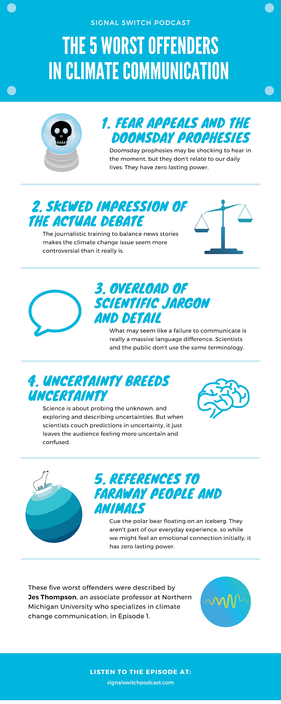

# What can we do?

## Adaptation vs mitigation

Strategies that we can take to combat climate change generally fall into one of two categories: adaptation and mitigation. What's the difference?

With **adaptation**, we make choices that reduce the damage that climate change will cause. Examples include building sea walls to protect against rising sea levels and storm surges, genetically modifying crops to be more drought-tolerant, and many other actions.

On the other hand, **mitigation** aims to reduce how much the earth’s climate changes in the first place. This means changing our lifestyles and economies to reduce our output of greenhouse gases, such as by increasing the use of renewable energy or reducing the consumption of meat. Let's take a look at this article from NASA, which goes over these two strategies in more depth.

*   [Article on adaptation vs mitigation by NASA](https://climate.nasa.gov/solutions/adaptation-mitigation/)

In our battle against climate change, we'll have to use both adaptation and mitigation strategies. We need to clean up the mess for damage that's already been caused with adaptation, like the current greenhouse gases in the air that we need to draw down. However, we also need to prevent future damage to come with mitigation, like investing in clean energy to stop more carbon from entering the atmosphere.

## Nature based solutions

While there are gadgets currently being engineered to remove carbon from the atmosphere, one of the most powerful tools in our arsenal happens to also be the most natural: trees! As mentioned in Unit 1: Intro to Climate Change, trees and vegetation store significant amounts of Earth's carbon. Unlike mammals, plants use photosynthesis to create food, taking _in_ carbon dioxide, and giving _out_ oxygen for us to breathe. We already know that trees cool us down—without sufficient green space, urban heat islands are significantly hotter than their surrounding land. Let's watch this basic overview of natural solutions at our disposal from the YEARS Project.

<iframe width="560" height="315" src="https://www.youtube-nocookie.com/embed/gSXOxrjCA40" frameborder="0" allow="accelerometer; autoplay; clipboard-write; encrypted-media; gyroscope; picture-in-picture" allowfullscreen></iframe>

Restoring forests, protecting wildlife biodiversity, and rebuilding coastal habitats are all top priority when it comes to natural solutions. Now, let's dive deeper by visiting the Natural Climate Solutions web page. 

*   [Natural Climate Solutions](http://naturalclimatesolutions.org/)

**Q: Read through each of the described solutions. Which one did you find most interesting, and why?**

<textarea placeholder="Preview submission area. Answers are not saved."></textarea>

Planting trees has been hailed as the hallmark of going green, but new research finds that it might actually harm some land areas. Should we stop planting trees? Let's check out this infographic to find out.

*   [Should we stop planting trees?](https://www.instagram.com/p/CGIkj9eJLdi/), @climateduteam on Instagram

Trees aren't the only carbon sink that we should be investing in as a natural solution. In his TED Talk, Tim Flannery explains why seaweed is a great option for biological carbon drawdown. In fact, it might even be better than planting trees!

<iframe width="560" height="315" src="https://www.youtube-nocookie.com/embed/tuvxXnQrRv8" frameborder="0" allow="accelerometer; autoplay; clipboard-write; encrypted-media; gyroscope; picture-in-picture" allowfullscreen></iframe>

Seaweed's going to get big—he's betting on it now. Seaweed farms are also a two-in-one solution, providing a great environment for sustainable aquaculture that we can rely on in the future. 

Hemp is yet another natural solution that can we use for carbon capture, in addition to forests and seaweed. Let's check out this video from the YEARS Project, where Morgan Schacker explains hemp's potential.

<iframe width="560" height="315" src="https://www.youtube-nocookie.com/embed/4gNlgxC8MY8" frameborder="0" allow="accelerometer; autoplay; clipboard-write; encrypted-media; gyroscope; picture-in-picture" allowfullscreen></iframe>

In addition to carbon capture, we can use hempcrete in our buildings, hemp fibers in our clothing, hemp plastic as a biodegradable disposable, and hemp roots to purify soil. Hemp Hemp Hurray!

## Innovative technologies

Technology obviously has done a lot of harm to our planet, but now people are working on using tech to help save the planet and counter climate change! Many engineers and scientists have been inventing and working on new ways to help. 

**Carbon capture and storage:** One way people have been trying to undo climate change is taking the carbon directly out of the atmosphere and storing it somewhere else (such as the ground). This general umbrella of innovations falls under carbon capture and storage (CCS). Read the following article and watch the video at the end.

*   [What is CCUS?](https://www.ccsassociation.org/discover-ccus/explore-ccus/), CCS Association webpage

**Q: What is carbon capture and storage used for? Why is it so important?**

<textarea placeholder="Preview submission area. Answers are not saved."></textarea>

**Q: There are many different ways to capture carbon. What do they all do chemically that is the same? What are the three methods of doing this and how do they differ? What do you think are the different advantages of each?**

<textarea placeholder="Preview submission area. Answers are not saved."></textarea>

Another cool way people have been trying to store carbon more efficiently is through plants. Read this next article to find out more.

*   [What If GMOs Can Fight Climate Change?](https://www.forbes.com/sites/jeffmcmahon/2019/05/07/what-about-gmos-that-fight-climate-change/#414f443d3e1b), Forbes article

**Geoengineering:** People have become more and more anxious and ways to fix climate change (if you can not tell from this entire course already).  People are proposing **geoengineering solutions**, which directly involve changing the environment to intervene with climate change.

One popular proposal is Stratospheric Aerosol Injection (SAI). The idea behind SAI is injecting inorganic particles–such as sulfur dioxide–into the stratosphere to block sunlight. Carbon Capture and Storage and Solar Radiation Management fall under this broad category. Some other examples: cloud seeding, tropical reforestation, ocean iron fertilization, and building thicker sea ice. 

Geo-engineering approaches exhibit vast unpredictability and potentially great risk, and should not be enacted without careful study and evaluation of both the direct and side effects and ethical and moral issues. Let's watch this video to find out.

<iframe width="560" height="315" src="https://www.youtube-nocookie.com/embed/dSu5sXmsur4" frameborder="0" allow="accelerometer; autoplay; clipboard-write; encrypted-media; gyroscope; picture-in-picture" allowfullscreen></iframe>

**Q: The title of the video is “A Horrible Idea We Might Have To Do”. Many scientists agree with the part that calls geoengineering a “horrible idea” and do not support geoengineering at all. Why do you think this is the case? What are some concerns people might have?**

<textarea placeholder="Preview submission area. Answers are not saved."></textarea>

To see what other people have to say about this, and to learn about a couple other examples of geoengineering, watch the next two videos.

<iframe width="560" height="315" src="https://www.youtube-nocookie.com/embed/OBTVK8ajqa4" frameborder="0" allow="accelerometer; autoplay; clipboard-write; encrypted-media; gyroscope; picture-in-picture" allowfullscreen></iframe>

 
<iframe width="560" height="315" src="https://www.youtube-nocookie.com/embed/wgyhnFHm1uE" frameborder="0" allow="accelerometer; autoplay; clipboard-write; encrypted-media; gyroscope; picture-in-picture" allowfullscreen></iframe>

**Q: What are your opinions on these “silver bullet solutions”? Of the different solutions you have learned about (BECCS,  SRM, SAI, etc) which solution do you think would be the best? What are the pros and cons to each of them?**

<textarea placeholder="Preview submission area. Answers are not saved."></textarea>

**Urban Reimagining:** We have already looked at how Manhattan could change if we live in a world without cars. Many people are focusing specifically on Urban innovations in design and technology. One company that focuses on this is Sidewalk Labs. Take a look at their blog and chose one article to read.

*   [Sidewalk Labs webpage](https://www.sidewalklabs.com/)

**Q: Write up a short summary and analysis of what you read. What did you learn?**

<textarea placeholder="Preview submission area. Answers are not saved."></textarea>

## Legislature

We've mentioned many personal actions to take in our fight to curb climate change, but one of the most important and most effective climate solutions is to enact government policy. Lifestyle changes on the individual level certainly make a difference in the long term, and we also have the ability to affect the individuals around us. However, there will always be groups of people who believe that climate change isn't real. How, then, do we push them to take climate action? Government laws and policies apply to everyone across the board, and they push corporations to make changes that they wouldn't otherwise be motivated to make. Watch this video by Our Changing Climate to learn about why we need to pursue both individual and structural change when it comes to fighting for our planet.

<iframe width="560" height="315" src="https://www.youtube-nocookie.com/embed/RSgXcFdHxFI" frameborder="0" allow="accelerometer; autoplay; clipboard-write; encrypted-media; gyroscope; picture-in-picture" allowfullscreen></iframe>

Quickly mobilizing the public to take action falls largely in the hands of the government, whether it be incentivizing people to eat more plant-based with a meat tax, banning single-use plastics, or subsidizing renewable energy sources. In this section, we'll discuss how the U.S. government has advocated for the environment in the past, how it's advocating right now, and how it can advocate in the future.

Past U.S. government administrations laid the ground work with Environmental Protection Agency (EPA) laws, with notable work falling under Richard Nixon's presidency. Let's read this article from _The Atlantic_, where Robinson Meyer explains the history of how the U.S. protects the environment.

*   [How the U.S. Protects the Environment, From Nixon to Trump](https://www.theatlantic.com/science/archive/2017/03/how-the-epa-and-us-environmental-law-works-a-civics-guide-pruitt-trump/521001/), The Atlantic article

Countries that have signed on to the Paris Agreement understand that they collectively need to reduce emissions and halt climate change, but there's significant disagreement when it comes to who's really pulling their weight. Developing countries who want to innovate quicker and catch up to the world stage expect larger, more developed countries to take the lead with intense cuts to emissions and economic investments in green infrastructure. On the other hand, those more developed countries believe that developing countries shouldn't continue polluting the planet in the name of "innovation." It's a complicated issue, so let's watch the following video from Kurzgesagt to learn more.

<iframe width="560" height="315" src="https://www.youtube-nocookie.com/embed/ipVxxxqwBQw" frameborder="0" allow="accelerometer; autoplay; clipboard-write; encrypted-media; gyroscope; picture-in-picture" allowfullscreen></iframe>

Using your knowledge about some of the nuances associated with who should take the "blame" for climate change, let's explore this interactive visualizer from the New York Times. How much would each country have to contribute in order to collectively stay within our carbon budget? 

*   [Global carbon budget interactive](https://www.nytimes.com/interactive/2017/08/29/opinion/climate-change-carbon-budget.html?mtrref=www.nytimes.com&assetType=PAYWALL), NYT interactive

**Q: Which countries can continue at their current pace, and which other countries have to flatten, reduce, or eliminate? Using your knowledge from the previous video, explain a plausible scenario or solution, and justify your answer.**

<textarea placeholder="Preview submission area. Answers are not saved."></textarea>

### The Green New Deal

How is America fighting climate change today? We're actually not doing great—the Trump administration [pulled out of the Paris Climate Agreement](https://www.nytimes.com/2019/11/04/climate/trump-paris-agreement-climate.html) in November 2019, and Trump started a race toward the end of his term in 2020 to roll back [100 environmental protection rules](https://www.nytimes.com/interactive/2020/climate/trump-environment-rollbacks.html). Let's learn about the **Green New Deal**, a congressional resolution that lays the groundwork for taking climate action in the U.S while providing just and economically sound transition for workers in the energy sector. You may have heard the term in passing, but many overlook what the Green New Deal really encompasses. Let's check out this video from Vox that breaks down exactly what's in the Green New Deal.

<iframe width="560" height="315" src="https://www.youtube-nocookie.com/embed/GxIDJWCbk6I" frameborder="0" allow="accelerometer; autoplay; clipboard-write; encrypted-media; gyroscope; picture-in-picture" allowfullscreen></iframe>

Next, let's watch a couple of videos from the series, "The Truth About the Green New Deal," where policy lead Rhiana Gunn-Wright debunks myths and misconceptions commonly associated with the Green New Deal. First up: the Green New Deal isn't the economic detonator that some make it out to be.

<iframe width="560" height="315" src="https://www.youtube-nocookie.com/embed/uVyMfBpEZuA" frameborder="0" allow="accelerometer; autoplay; clipboard-write; encrypted-media; gyroscope; picture-in-picture" allowfullscreen></iframe>

Next time you hear the $93 trillion number, make sure to call it out in the name of stopping misinformation. In fact, investing money now in a safer future is the only way to avoid bleeding the infinitely many costs associated with a lack of climate action, including loss of infrastructure, increased health conditions, and all of those terrifying impacts mentioned in Unit 2: "Why does climate change matter?".

One of those impacts mentioned in the impacts unit was actually an ethical consideration: the irresponsible actions of corporations impact marginalized communities the most. The Green New Deal seeks to bring equity to American communities, addressing an issue core to environmentalism. In this second video from the YEARS Project, Rhiana Gunn-Wright explains how the Green New Deal works toward solving equity issues, and why it's so important that it does.

<iframe width="560" height="315" src="https://www.youtube-nocookie.com/embed/c7GAa4ajvwU" frameborder="0" allow="accelerometer; autoplay; clipboard-write; encrypted-media; gyroscope; picture-in-picture" allowfullscreen></iframe>

**Q: How do you feel about the Green New Deal? Do you feel like there are concerns that Gunn-Wright didn't address? What are some ways that we can eliminate the misconceptions that she mentioned?**

<textarea placeholder="Preview submission area. Answers are not saved."></textarea>

While all five videos from the series are certainly informative and useful, we specifically took a look at the first two. Feel free to watch the other three if you desire!

### Putting a price on carbon

Beyond the overarching legislature that would set American in a new, green direction focused on a renewable energy sector, the government can also tackle emissions by placing a price on carbon. Read this article from the Climate Lab and watch its corresponding video, which discusses how California's cap-and-trade program lowered emissions, boosted the economy, and lent a helping hand to communities in need.

*   [The California model: make polluters pay](https://www.universityofcalifornia.edu/longform/california-model-make-polluters-pay), Climate Lab article

Similar to a cap-and-trade program, a carbon tax would place a direct tax on emissions, providing a monetary incentive for businesses to cut down on fossil fuel reliance. The fee-and-dividend proposition divides money raised from carbon taxes and fees and cuts a check to every individual. Check out this next article from Yale Environment 360, where Bill McKibben discusses the need for a carbon tax, as well as some of its drawbacks. 

*   [Why we need a carbon tax, and why it won't be enough](https://e360.yale.edu/features/why_we_need_a_carbon_tax_and_why_it_won_be_enough), Yale E360 article

McKibben specifically emphasizes that a carbon tax can't be our only solution to the emissions and the climate crisis; it must be implemented in conjunction with other solutions, too.

Although our current administration has induced national setbacks to establishing a greener America and stalled progress for the Green New Deal, state and city governments are carving their own environmentally-positive paths. Many have passed [their own versions of the Green New Deal](https://www.sierraclub.org/trade/green-new-deal-already-underway-states-and-cities), including Maine, New York City, Washington, D.C., and Seattle. While rebuilding the economy after pandemic lockdowns, some states have plans to do so on a cleaner, greener, platform. Let's read this article from InsideClimate News, which discusses five state plans that  utilize COVID-19 stimulus funds to support clean energy and carbon-cutting programs.

*   [States are doing what big government won't to stop climate change](https://insideclimatenews.org/news/08092020/states-rural-government-coronavirus-stimulus-climate-change?utm_source=InsideClimate+News&utm_campaign=b298d46663-&utm_medium=email&utm_term=0_29c928ffb5-b298d46663-327969729), InsideClimate News 

**CHOOSE ONE (OR DO BOTH): Summarize the initiatives of one of the five states mentioned in the article. Do you think those measures will be effective? OR Research what your state is working on to combat climate change. How does your state stack up against the ones mentioned in the article?**

<textarea placeholder="Preview submission area. Answers are not saved."></textarea>

**Q: What if you ran your own city, state, or country? How would you use policy to curb global warming? Which laws would you pass first? Would you stick to what governments are doing right now, or do you have new ideas?**

<textarea placeholder="Preview submission area. Answers are not saved."></textarea>

**OR**

**OPTIONAL: if you're feeling up to the challenge, complete the En-ROADS guided assignment. You'll be able to experiment with the En-ROADS simulator to create a scenario that not only solves climate change, but also does it in a way that uplifts our economy and society. Think of it like enacting your own Green New Deal!**

*   [En-Roads assignment](https://www.climateinteractive.org/tools/guided-assignment/)

<textarea placeholder="Preview submission area. Answers are not saved."></textarea>

## Spreading awareness

### Why is climate change so hard to conceptualize?

We're familiar with the climate change deniers that insist it's all a hoax, but what about the average person that shies away or says they aren't so sure? As it turns out, it's not necessarily an individual's fault that they don't want to think actively about climate change—the very nature of the subject makes it very, very hard to wrap our minds around. Let's watch this video from the Climate Lab, where Dr. M. Sanjayan explains why exactly humans are so bad at conceptualizing climate change.

<iframe width="560" height="315" src="https://www.youtube-nocookie.com/embed/DkZ7BJQupVA" frameborder="0" allow="accelerometer; autoplay; clipboard-write; encrypted-media; gyroscope; picture-in-picture" allowfullscreen></iframe>

No one likes to be in a constant state of doom and gloom, and the nature of climate change requires us to act in prevention instead of responding to crisis. We have to make these sacrifices as a society because it is necessary, but it's hard to even visualize such earth-shattering effects. Although we're more used to cleaning up messes and picking up the pieces, investing prevention is the only option that saves our planet. It's so broad and all-encompassing that it's tempting to push away, but our goal is to find a better way to communicate these effects without imparting unnecessary stress.

### Covering up the crisis: ExxonMobil's mission

<blockquote class="twitter-tweet">
.<a href="https://twitter.com/exxonmobil?ref_src=twsrc%5Etfw">@exxonmobil</a> when presented with indisputable scientific proof that their activities are harming the planet: <a href="https://t.co/jmSYOZx3hz">pic.twitter.com/jmSYOZx3hz</a>
&mdash; maddie graham ❄️☃️🌲 (@madelineelisaa) <a href="https://twitter.com/madelineelisaa/status/1279930540565696514?ref_src=twsrc%5Etfw">July 6, 2020</a></blockquote>

Okay, but really. Despite learning decades ago about how terrible their industry would be for the environment, companies like ExxonMobil chose to spend unfathomable sums of money to confuse the public instead of addressing the problem. AsapSCIENCE explains why there's so much controversy surrounding climate change today, despite a pretty clear and consistent consensus from climate scientists.

<iframe width="560" height="315" src="https://www.youtube-nocookie.com/embed/TbW_1MtC2So" frameborder="0" allow="accelerometer; autoplay; clipboard-write; encrypted-media; gyroscope; picture-in-picture" allowfullscreen></iframe>

Not only did 80% of Americans agree in the 1980s that climate change was a real issue, climate change was also once not a political issue (and it still shouldn't be today). Exxon went against their own science repeatedly out of a short-sightedness and greed for money. Media sources developed a habit of framing the climate crisis as a "debate," and journalists tried to find sources and evidence for both sides of that "debate." Only in recent years have journalists since ceased to represent both perspectives, as the presence of different perspectives reflects a lack of understanding rather than a concept that's actually debateable. Today, corporations are still trying to manipulate narratives around climate change, stalling climate action and climate policy in the interest of profits at the expense of regular people.

### Talking about climate change

Well, we're not the government, so how do we personally go about enacting structural change? Ideally, a government serves the interests of its people, so the overarching goal is to show that you care about the issue, and show that _a lot_ of people care about the issue. Simply talking to others around you about the prevalence of the climate crisis is already a form of activism. In fact, climate scientist Katharine Hayhoe says that talking about the climate crisis is one of the most impactful things we can do. 

<iframe width="560" height="315" src="https://www.youtube-nocookie.com/embed/etFPa-tVo5c" frameborder="0" allow="accelerometer; autoplay; clipboard-write; encrypted-media; gyroscope; picture-in-picture" allowfullscreen></iframe>

Helping climate deniers understand the truth and science behind climate change is on the docket, but what's the most successful way to talk about them? We know _why _we should talk about climate change, but _how _should we talk about it? Core disagreements like these can quickly spiral into raging arguments, where neither person is listening to the other at all—which means that you won't be able to get your message across. While you might be eager to dish out the facts (and you're thinking _they _should really be listening to _you_), it's important to take a step back and create a productive and open-minded environment for discussion. In the following animation, the Alliance for Climate Education explains the secret to successfully talking about climate change.

<iframe width="560" height="315" src="https://www.youtube-nocookie.com/embed/RkklaXhbTuA" frameborder="0" allow="accelerometer; autoplay; clipboard-write; encrypted-media; gyroscope; picture-in-picture" allowfullscreen></iframe>

That's it! Even though you have important information to spread, the first step is to _listen_. If you care about what the other person has to say, then they're more likely to care about what you have to say, too.

**Q: In the video, we're told to focus on personal experiences to build trust and safety. After listening to the other person, what will you say about your own experience? (How did you learn about climate change, why does it matter to you, and what do you care about most?)**

Curious about more tactics that help you talk about climate change? Professor Jes Thompson from Northern Michigan University outlines the top five _worst_ offenders when it comes to talking about climate change:

Instead, we should focus on who our audience is, and tie climate change to how it impacts what they care about, from camping to coffee to public health. Climate change connects to everything! Furthermore, avoiding the doom and gloom is crucial to creating the possibility or future chats about climate change. Try to end on a positive note (and start with one too!) that focuses on the solutions we can take and the hope that we have.

### Combatting common counterpoints

Large oil and fossil fuel companies successfully confused the American population by blurring the story of the climate crisis, and now we have the responsibility to re-distribute the truth. How do we respond to some of the most common counterpoints against climate change? 

First of all, use information that you learned while taking this course! Many counterpoints just take a bit more understanding and context to rebut, and you've certainly gathered a lot of that information in the previous units. However, many sources have also compiled quick, snappy, and accurate answers to some of the most common questions. In fact, Coby Beck from Grist has assembled an extensive list of articles from his series "How to talk to a climate skeptic," all in one place. Feel free to take a skim right now, and pull these out from your arsenal the next time you need to address a counterpoint.

*   [Common Denier Arguments](https://opr.ca.gov/facts/common-denier-arguments.html), California Governor's Office of Planning and Research
*   [How to talk to a climate skeptic: a complete list](https://grist.org/series/skeptics/), Grist
*   [Skeptical Science](https://www.skepticalscience.com/)

Great! Those sources (and our course) address confusions regarding whether climate change is _real_, but what happens after that? Even though they acknowledge that climate change is real, some still might argue that there isn't a case for taking climate action to saving our planet. One of the most prominent arguments against taking immediate and drastic climate action is the cost that we pay upfront. For those who prioritize the health of the economy over the health of people, investing in clean energy and sustainable practices may seem like an unnecessary sacrifice.

As Green New Deal policy lead Rhiana Gunn-Wright mentioned, if we don't invest in a safer tomorrow, then we'll be bleeding a much greater cost later on. Looking for a source, or more specifics? The Harvard Business Review outlines why fighting climate change is actually more economically beneficial in the following article. Written in 2017, some its prophesies have already come true (like the cost of more frequent human pandemics).

*   [If You Think Fighting Climate Change Will Be Expensive, Calculate the Cost of Letting It Happen](https://hbr.org/2017/06/if-you-think-fighting-climate-change-will-be-expensive-calculate-the-cost-of-letting-it-happen), Harvard Business Review

What about people who believe that we need to take action with policy, but that they personally can't do anything about climate change? Let them know that one of the most effective ways of taking action is to talk to others about it! Reaching out to our social circles is something we can all do—and for free, too.  Beyond spreading the word, there's value in making individual changes like trying a more plant-based diet and minimizing our waste. While the impact of one individual might not seem like much, the repeated actions of many individuals accumulate quickly. Furthermore, when we make small changes in our own lives, we create ripple effects in communities around us by starting more conversations and implicitly encouraging others. 

In his blog post for Sierra Club, ["Yes, Actually, Individual Responsibility is Essential to Solving the Climate Crisis,"](https://www.google.com/search?q=why+individual+actions+matter+for+climate+change&rlz=1C1CHBF_enUS777US777&sxsrf=ALeKk01SOwxp2ZNDFO1BKicOLvmintnhNA:1603334890412&ei=6vKQX5HaGOrNytMPpNqayAU&start=20&sa=N&ved=2ahUKEwiR9-T0l8fsAhXqpnIEHSStBlk4ChDy0wN6BAgJEDI&biw=1920&bih=969) Jason Mark explains that individual action doesn't distract from taking collecting action and keeping the blame on large corporations. In fact, it empowers taking collective action. Our personal actions have power beyond the impact it has on our planet—they also "deepen our commitment to environmental sustainability" and encourage us to start living the life we want to see. 

Individual actions foster an emotional investment in the climate crisis, which then pushes those individuals to _want_ to take more actions, including collective and political ones. As Mark puts it, "When we take responsibility for the environmental consequences of our daily actions, we feel like we are in control. And when you’re in control of your own life, perhaps then you’ll feel more empowered to take control of—or at least play a role in—larger political systems." Moreover, connecting our values to concrete actions also sparks the discussion around us, and speaks volumes to how important the crisis really is to us as individuals.

Overall, the goal isn't to pressure everyone into taking individual change, especially when it's inaccessible or costly for them. The ultimate responsibility lies in the hands of corporations and the government, who need to make it more affordable and accessible to live a sustainable lifestyle. However, changes on the individual level play an important role, and may very well the catalyst for big-picture structural change.

### Activism and protests

Showing passion and generating awareness can take form in infinitely many ways, whether it be organizing phone call and letter-writing campaigns to local politicians, creating powerful art, reporting climate stories, or something different altogether. One of the most popular ways is taking to the streets. Let's watch this video from Our Changing Climate, explaining exactly why protests matter and highlighting youth activists who are at the forefront of the action.

<iframe width="560" height="315" src="https://www.youtube-nocookie.com/embed/sP9TGpBGy08" frameborder="0" allow="accelerometer; autoplay; clipboard-write; encrypted-media; gyroscope; picture-in-picture" allowfullscreen></iframe>

**Q: Have you ever been to a climate protest? How did it make you feel? Do you have any funny or interesting stories to tell about the experience?**

<textarea placeholder="Preview submission area. Answers are not saved."></textarea>

Youth climate activists are spearheading the movement, leading organizations like [Sunrise Movement](https://www.sunrisemovement.org/), [Fridays for Future](https://fridaysforfuture.org/), [Extinction Rebellion](https://rebellion.global/), and [Zero Hour](http://thisiszerohour.org/). They're specifically dedicated to showing the world just how much the climate crisis matters. So, what if you want to be a climate activist? How do you go about it? These next guides on why and how you should be an activist are optional, but very useful if you're curious.

*   [Why you should be a climate activist](https://www.youtube.com/watch?v=Ie9cACQnqew), Ted Talk (Luisa Neubauer)
*   [6 tips for becoming a youth activist (as told by a youth activist)](https://grist.org/justice/6-tips-for-becoming-a-youth-activist-jamie-margolin/), Grist article

As Luisa Neubauer mentions, each one of us should seek to be an "environmental activist" in our own way, whether through organizing mass actions, pressuring politicians, simply spreading the word in daily conversations with family and friends, or another avenue altogether.

**Q: What's your move? How do you plan to support the health and safety of our planet?**

<textarea placeholder="Preview submission area. Answers are not saved."></textarea>

## What you can do right now

Congratulations! You've reached the end of this course. If you're itching to save the planet, here are actions that you can take right now.

1. Volunteer with activist groups and movements. Contact your representatives and push for them to support methods combating climate change. Organize a letter-writing campaign (or a phone blast action) with your friends or with a local activism group. More specific requests are usually more impactful, so do your research about specific laws and policies that need support in your area.
2. Reduce your own carbon footprint. Invest in energy efficient appliances and turn off your lights and air conditioning when you're not using them. Eat more plant-based, reduce food waste, and buy local as your budget allows. Reduce your vehicle emissions by carpooling, using public transportation, and choosing a fuel efficient or electric vehicle. There's always a more sustainable option, so keep a resourceful eye out!
3. Keep educating yourself and others. Encourage others to vote for candidates who prioritize the climate, and tell them about what you learned throughout this course. You could even consider a career in climate science, climate communication, or climate policy!
4. Put your money where your mouth is. Buy products from businesses that value sustainability, and donate to reputable charities who are fighting climate change.

That's it! Save the world and have fun doing it, too. Happy learning!
