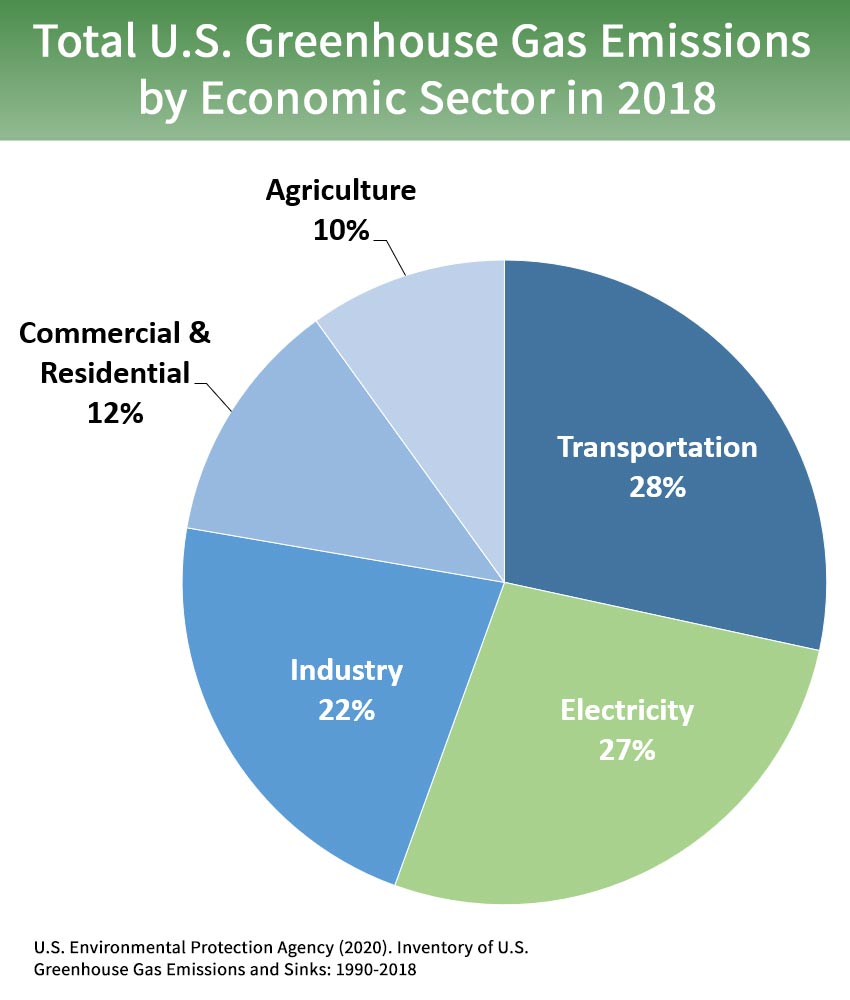
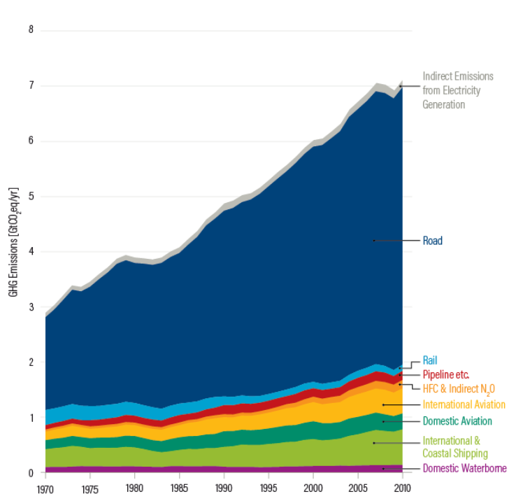
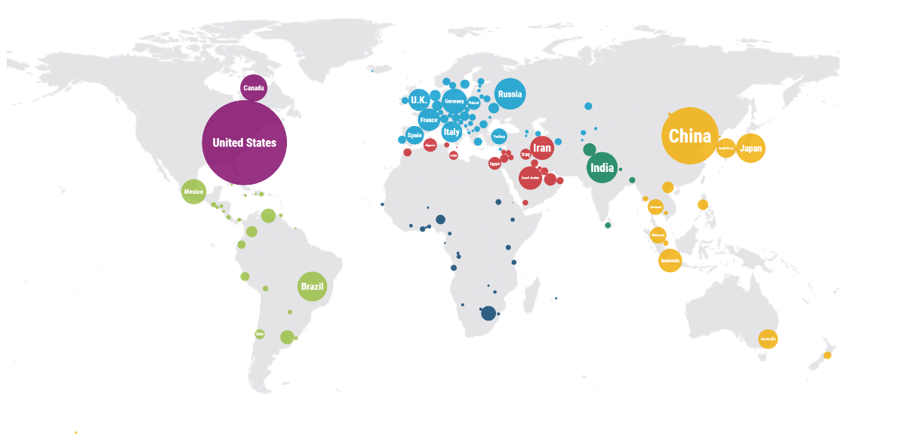
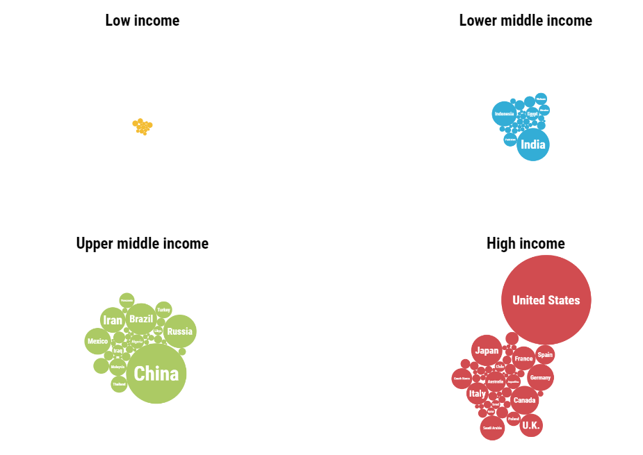
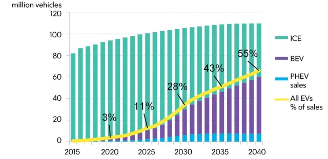

# Transportation

## Public vs. private transportation

### Where do most of our emissions come from?	

If you recall from the energy section, one of the biggest causes for the rising global temperature is fossil fuels. Thus, to prevent the planet from warming up even more, humans must decarbonize.

Greenhouse gases come from a variety of sources, with a surprising fraction coming from transportation. Take a look at the following brochure from the American Public Transportation Association to learn about the climate issues with transportation and how public transportation can help alleviate these problems.

*   [Public Transportation Reduces Greenhouse Gases and Conserves Energy](https://www.apta.com/wp-content/uploads/Resources/resources/reportsandpublications/Documents/greenhouse_brochure.pdf), American Public Transportation Association

Right now in the United States, 28% of carbon emissions come from transportation. The United States emits the most amount of total carbon dioxide globally.

Next, let's analyze a few graphics from this [blog post](https://www.wri.org/blog/2019/10/everything-you-need-know-about-fastest-growing-source-global-emissions-transport) from the World Resources Institute:

**Q: How do you think the emissions changed after 2010?**

<textarea data-unit="6" data-key="1" id="6.1" placeholder="Enter your response here." onblur="updateResponse(this)" oninput="editedResponse(this)"></textarea>

**Q: Take a look at three of the countries you see in the graphic.  Research what factors (like agriculture, manufacturing, or others) contribute to the emissions from those three countries.**

<textarea data-unit="6" data-key="2" id="6.2" placeholder="Enter your response here." onblur="updateResponse(this)" oninput="editedResponse(this)"></textarea>

**Q: What patterns do you see? Why is this the case? Why do you think some high and upper middle-income countries have such a small amount of emissions?**

<textarea data-unit="6" data-key="3" id="6.3" placeholder="Enter your response here." onblur="updateResponse(this)" oninput="editedResponse(this)"></textarea>

Next, choose one of the videos from this page to watch. If you're interested, feel free to read through the whole page and watch all the videos.

*   [CLIMATE CHANGE & TRANSPORT](https://www.theconsciouschallenge.org/ecologicalfootprintbibleoverview/climate-change-transport), The Conscious Club

**Q: What did you learn and find interesting in the video? Why did you choose to watch this video?**

<textarea data-unit="6" data-key="4" id="6.4" placeholder="Enter your response here." onblur="updateResponse(this)" oninput="editedResponse(this)"></textarea>

We can reduce our carbon emissions from transportation in a number of ways—one of the main solutions people have been looking at is public transportation. Although the United States currently has a lot of public transportation, it is being used significantly less than other nations, such as the UK.

**Q: How do you think your local, state, and national government can help increase the use of public transportation?**

<textarea data-unit="6" data-key="5" id="6.5" placeholder="Enter your response here." onblur="updateResponse(this)" oninput="editedResponse(this)"></textarea>

Take a look at this article to learn more about the relationship between climate change and transportation, and read the second article to learn more about the benefits of public transportation. 

*   [Climate Change and Public Transportation](http://bic.asn.au/information-for-moving-people/climate-change-and-public-transport)
*   [Why is public transportation good for the environment?](https://www.nationalexpresstransit.com/blog/why-is-public-transportation-good-for-the-environment/)

In fact, we could get rid of our carbon emissions from transportation altogether. One solution that could get us there is the zero-carbon grid. The zero-carbon grid combines onshore wind, offshore wind, solar, geothermal, biomass, nuclear, hydro and optimizes them to run everything, including our vehicles. Watch this video to learn about how the zero-carbon grid works and how it can help us.

<iframe width="560" height="315" src="https://www.youtube-nocookie.com/embed/pQzSyMnEw-o" frameborder="0" allow="accelerometer; autoplay; clipboard-write; encrypted-media; gyroscope; picture-in-picture" allowfullscreen></iframe>

## Buying local

How many times have you and your family shopped online this past month? If you’re like most families, probably several. It is hard to imagine a world without online shopping. Instead of having to drive all the way to a store, you can just click a few buttons, and BAM, your new shoes are going to magically appear on your doorstep in two days.

However, by saving yourself some time, you may have sacrificed the climate. You might be a bit confused. After all, didn’t we just say that you no longer have to drive to the store? Instead of having several people drive to the store, just one single delivery person has to drive around.

The problem is that people want to get their stuff as quickly as possible. Since you probably would rather get your pair of shoes in two days rather than...let’s say seven, companies are going to put out more trucks on the road with fewer items in each truck for maximum efficiency.

Trucks are the vehicles creating the most pollution as they rely on diesel fuel to move around. So having a bunch of passenger cars on the road may actually be cleaner than having a couple of delivery trucks driving around everywhere. 

<iframe width="560" height="315" src="https://www.youtube-nocookie.com/embed/5HOijUtExiM" frameborder="0" allow="accelerometer; autoplay; clipboard-write; encrypted-media; gyroscope; picture-in-picture" allowfullscreen></iframe>

**Q: The video talks a bit about new ways technology, such as smart traffic lights, are tackling this issue. Can you think about some other ways technology can help reduce emissions?**

<textarea data-unit="6" data-key="6" id="6.6" placeholder="Enter your response here." onblur="updateResponse(this)" oninput="editedResponse(this)"></textarea>

So while engineers continue developing ways to reduce truck emissions, what can everyone else do about this? As consumers, we should try to consolidate our orders as much as possible to lessen the number of trips and to choose slower shipping options. Companies should inform everyone that slower shipping means less emissions in the air, as the video mentioned with the “green option” for delivery.

**Q: Take a look at your (or another family member’s) online shopping activity this past month. How many orders have you made? How long did it take for each order to arrive? What changes do you think you (or your family member) can make to your online shopping habits to make it greener?**

<textarea data-unit="6" data-key="7" id="6.7" placeholder="Enter your response here." onblur="updateResponse(this)" oninput="editedResponse(this)"></textarea>

## Solution

Of course, it is going to be extremely difficult for the world to just suddenly get rid of cars. However, because of how long this issue has been left unattended, slower approaches to shifting away from carbon-emitting transportation will not be enough. One popular solution is not to completely stop using cars, but rather to replace our current cars with more environmentally friendly ones. Still, though,we will have to improve on other modes of transportation —  especially public transportation. 

Humans have always been drawn to cities —  centers of innovation and commerce that bring large amounts of change. Yet cities are huge contributors to climate change, consuming 80% of Earth's energy. There needs to be a drastic change in the way humans move and live in urban areas. Read this article that was written in 2020, during the coronavirus pandemic, about developing a car-free city.

*   [I've seen a future without cars, and it's amazing](https://www.nytimes.com/2020/07/09/opinion/sunday/ban-cars-manhattan-cities.html), NYT article

**Q: What are your thoughts on a world without cars?**

<textarea data-unit="6" data-key="8" id="6.8" placeholder="Enter your response here." onblur="updateResponse(this)" oninput="editedResponse(this)"></textarea>

Next, read this silly piece of satire from the Onion ([here's](https://www.youtube.com/watch?v=io58hl1Z0TY) an explainer, if you don't know about satire).

*   [Future Of Green Transportation May Be 16-Ton Possum That Passengers Cling To Like Babies](https://www.theonion.com/experts-say-future-of-green-transportation-may-be-16-to-1844636887), Onion article

Obviously, this is not actually going to happen. But…

**Q: What is a crazy green transportation idea that you'd like to see happen in the future?**

<textarea data-unit="6" data-key="9" id="6.9" placeholder="Enter your response here." onblur="updateResponse(this)" oninput="editedResponse(this)"></textarea>

Biking

During the Covid-19 Pandemic, there has been an immense surge of bikers. This is awesome since bikes are a carbon-free transportation method. However, this change revealed how our cities and towns aren’t prepared for a huge increase in bikers.

Watch this video to see how the U.S. can become more bike friendly: [https://www.youtube.com/watch?v=KclFJVZJdRI](https://www.youtube.com/watch?v=KclFJVZJdRI) 

**Q: How safe do you feel biking? If you don’t bike around as your main mode of transportation, what deters you from doing so? What are some solutions you think your city or town can make to make it more bike friendly?**

<textarea data-unit="6" data-key="10" id="6.10" placeholder="Enter your response here." onblur="updateResponse(this)" oninput="editedResponse(this)"></textarea>

EVs

Some of you may have already heard of Electric-Vehicle (EV) batteries. EV batteries power the electric motors of Battery Electric Vehicles (BEVs) and Hybrid Electric Vehicles (HEVs) and are the accepted replacement for the internal combustion engine (ICE) vehicles —  vehicles that use gasoline or diesel.  To learn more about these different types of electric vehicles, take a look at the following guide from EVgo.

*   [Types of Electric Vehicles](https://www.evgo.com/why-evs/types-of-electric-vehicles/), EVgo article

The battery system is one of the most important parts of an EV. EV batteries are rechargeable due to a reversible chemical reaction. This chemical process makes it possible to discharge and charge the battery. When discharging (when the battery is being used), electrical current flows from cathode (+) to anode (-). When charging, the electrical current flows from anode (-) to cathode (+). The most common type of EV battery is lithium-ion, but there are also lead-acid, nickel-metal hydride, zebra, and more. 

More and more people are buying and using EVs to replace their ICE vehicles.
    

<figcaption>Annual global vehicle sales. (Source: BloombergNEF)</figcaption>

Let's take a look at more data on EVs in 2020 from Bloomberg NEF.

*   [Electric Vehicle Outlook 2020](https://about.bnef.com/electric-vehicle-outlook/), Bloomberg NEF

**Q: When do they predict CO2 emissions from road transport will stop rising? Will it be too late by then?**

<textarea data-unit="6" data-key="11" id="6.11" placeholder="Enter your response here." onblur="updateResponse(this)" oninput="editedResponse(this)"></textarea>

Finally, here are some cool things happening in the world of EV batteries:

1. Europe has plans for heavy investment in electric vehicle battery development and production, and Indonesia also aims to produce electric vehicle batteries in 2023, inviting Chinese battery firm GEM and Contemporary Amperex Technology Ltd to invest in Indonesia.
2. President Barack Obama announced in 2009 that the American Recovery and Reinvestment Act will fund 2.4 billion US dollars for  48 new advanced battery and electric drive projects. This marked the single largest investment in advanced battery technology for HEVs and BEVs ever made as of 2020.