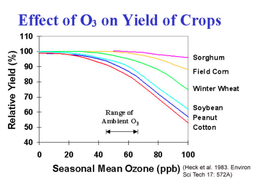

# Urbanization

When you think of urbanization, what first comes to mind? The tall skyscrapers of New York City,  the crowded crossroads from Tokyo? Throughout history,millions of people have moved from the countryland to cities for economic, social, and political reasons.  Perhaps unsurprisingly, this urbanization is an ongoing global trend! More than half the world population currently live in urban areas, and it’s projected that almost 7 billion people will live in urban areas by 2050. 

Air pollution and fossil fuel usage are probably some of the first environmental impacts you’d associate with urbanization, and you’d be right to do so. But further than that, there are many other factors of urbanization that contribute to the overall climate crisis. Let’s watch the following video from the Science Museum of Virginia to learn about urban heat islands. 

<iframe width="560" height="315" src="https://www.youtube-nocookie.com/embed/s_apVv7dbMQ" frameborder="0" allow="accelerometer; autoplay; clipboard-write; encrypted-media; gyroscope; picture-in-picture" allowfullscreen></iframe>

**Q: What are the contributing factors of urban heat islands? Why are urban heat islands harmful?**

<textarea placeholder="Preview submission area. Answers are not saved."></textarea>

Apart from the significant environmental damage, urban heat islands can be detrimental to human health, especially during heat waves, which are increasingly common.  Check out this global map of the number of deadly heat days in different countries during different years. Be sure to click on red and orange areas to see the heat anomalies and the deadly thresholds of that area.

*   [Heatwaves: Number of deadly heat days](https://maps.esri.com/globalriskofdeadlyheat/#), interactive map from University of Hawaii at Manoa

**Q: If you compare just the 2020 world map to the 2050 world map, what differences do you see?**

<textarea placeholder="Preview submission area. Answers are not saved."></textarea>

It’s not a coincidence that the hottest areas also happen to be in the world’s most urbanized cities. As we’ve just learned, they are indeed related! Try thinking of solutions that cities can work towards. Then take a look at this Grist video about the different steps that US cities have taken to diminish the urban heat island effect.

<iframe width="560" height="315" src="https://www.youtube-nocookie.com/embed/4bqqbYCfYYs?t=105" frameborder="0" allow="accelerometer; autoplay; clipboard-write; encrypted-media; gyroscope; picture-in-picture" allowfullscreen></iframe>

## Thermal inversions

If you’ve ever gone camping or hiking in the mountains, you’d know by experience that the higher you go, the colder it gets. However, there are times when the exact opposite occurs - temperature increases as altitude decreases. **Thermal inversions**, also known as temperature inversions, are natural phenomena in the atmosphere where the air above the ground is warmer than the air below it. Weird, right? Check out this video to see how thermal inversions occur in some of Utah’s cities. 

<iframe width="560" height="315" src="https://www.youtube-nocookie.com/embed/Pdir5MGV4_M" frameborder="0" allow="accelerometer; autoplay; clipboard-write; encrypted-media; gyroscope; picture-in-picture" allowfullscreen></iframe>

As the video explains, the main pitfall of thermal inversions is the trapping of emissions and air pollution from urban areas, especially those nestled in a valley between mountains. The warm air acts as a lid, essentially sealing and condensing all of the toxic pollutants near the ground, leading to poor air quality for urban residents. The terrain prevents the trapped cold air from escaping and the surrounding mountains prevent winds from ushering in fresh air. The end result is nasty, stagnant air that is not only unpleasant to live in but also hazardous to our respiratory systems. 

To add onto that, scientists have recently observed a pattern between climate change, thermal inversions, and “super pollution” events. It is possible that climate change is _worsening_ thermal inversions, and vice versa! Read this article to find out more about this issue. 

*   [Climate change has led to more temperature inversions and the rise of  'super pollution events'](https://www.greenbiz.com/article/climate-change-has-led-more-temperature-inversions-and-rise-super-pollution-events), GreenBiz article

In any case, because thermal inversions are naturally occurring, there is not much that we can do to prevent them from happening. But we _can_ take care of things on our end and continue reducing our carbon footprint. And who knows? Given the current rate of technological and scientific advancement, we may soon discover a long-lasting solution. 

## Photochemical smog

Everyone has a general idea of what smog is - usually a yellowish dense fog or haze blanketing cities such as San Francisco and Beijing. Let’s dive deeper behind the science of photochemical smog by watching this video. 

<iframe width="560" height="315" src="https://www.youtube-nocookie.com/embed/CdbBwIgq4rs" frameborder="0" allow="accelerometer; autoplay; clipboard-write; encrypted-media; gyroscope; picture-in-picture" allowfullscreen></iframe>

**Q: What are the two main components of photochemical smog and where do they come from?**

<textarea placeholder="Preview submission area. Answers are not saved."></textarea>

**How are the secondary pollutants formed and how do these pollutants affect human health?**

<textarea placeholder="Preview submission area. Answers are not saved."></textarea>

**What kinds of cities are the most vulnerable to photochemical smog (hint: their surrounding geographies)?**

<textarea placeholder="Preview submission area. Answers are not saved."></textarea>

**Tropospheric ozone**, one of the main pollutants of photochemical smog, is potent to all plant and animal life. Plants like tobacco, tomato, and spinach, are sensitive and therefore highly reactive to ozone. Therefore, photochemical smog has the ability to damage plant leaves, stunt growth, and increase vulnerability to disease. Studies conducted from 1980 to 1989 exposed the most important agronomic crops in the USA to varying concentrations of ozone (O3). Below were their findings:

**Q: What trends, if any, do you see in the graph? Which crop(s) lost the most yield and what implications does that have in our lives? What do you predict**

<textarea placeholder="Preview submission area. Answers are not saved."></textarea>

Let’s look at two ancient cities: Uruk and Anuradhapura. In 3000 BC, Uruk was more dense than modern day NYC and to accommodate the growing population, the city needed to expand its irrigation system. In 500 BC, Anuradhapura had a similar problem - they were growing constantly and the city depended on irrigation. 

As Uruk grew, its farmers chopped down trees to make space for more crops and infrastructure.  Uruk’s success was short-lived, however. Without trees to filter their water supply, Uruk’s irrigation became contaminated and left mineral deposits, rendering the soil way too salty to grow agriculture. Contrastingly, in Anuradhapura, trees were held sacred and preserved. Their irrigation system ended up working in conjunction with the surrounding forests and their population grew twofold. 

These are just a few examples drawn from history that show us just how important trees are, especially as the most natural solution for smog and urban hotspots. Watch this video to learn the ways in which trees offer a better quality of life. 

<iframe width="560" height="315" src="https://www.youtube-nocookie.com/embed/aKyvGHycngM" frameborder="0" allow="accelerometer; autoplay; clipboard-write; encrypted-media; gyroscope; picture-in-picture" allowfullscreen></iframe>

## Industry

When it comes to industry, it’s important to understand that our human contributions, climate change, and its threat to us have an interdependent relationship. The environment that results from our industrial practices in turn affects our lifestyles and public health. We’ll be exploring this relationship with specific industries in the following sections, so keep this in mind as you read. 

Economically speaking, industries are categorized into four sectors. For our purposes, we’ll be looking sector by sector at the involved industries and how they both contribute to and are impacted by the climate crisis. 

#### Primary (raw materials) 

The primary sector includes all industries involving the extraction and production of raw materials. The major industries in this sector are agriculture, forestry, mining, mineral extraction, and fishing, but we will only focus on a couple. 

**Mining:** On land, we are constantly gathering land resources like wood and crops from the earth, but our activity underground has become just as environmentally harmful. Our extractive industries (oil, gas, mining) play a huge role in further polluting and depleting the earth of its rich minerals. Watch this video to learn about fracking!

<iframe width="560" height="315" src="https://www.youtube-nocookie.com/embed/Tudal_4x4F0" frameborder="0" allow="accelerometer; autoplay; clipboard-write; encrypted-media; gyroscope; picture-in-picture" allowfullscreen></iframe>

**Q: What is the fracking fluid’s role in collecting oil and natural gases? What is flow-back liquid and how can it be dealt with? Why is fracking so controversial?**

<textarea placeholder="Preview submission area. Answers are not saved."></textarea>

With mining, we are literally reshaping the earth and unearthing large amounts of precious metals and sulfides. When sulfide reacts with water and air, it becomes sulfuric acid, which seeps into nearby streams and groundwater. This process is called **acid mine drainage** and it’s the biggest source of water pollution from mining. Because acid mine drainage can be up to 300 times more acidic than acidic rain, it’s extremely toxic to humans and other vulnerable species. Read this article to learn about all of the different impacts that mining has on the environment.

*   [Environmental Impacts of Mining](https://wman-info.org/resource/environmental-impacts-of-mining/), WMAN article

Here are videos that you can watch to learn more about the types of mining and each of their specific impacts on the environment:

*   [The Devastating Effects of Gold Mining](https://www.youtube.com/watch?v=wq0p5tnFnWs), NowThis World video
*   [South America’s Lithium Boom: A Blessing Or A Curse?](https://www.youtube.com/watch?v=AsxjjLbn28Q), NowThis World video
*   [How Sand Mining Destroys One Home to Build Another](https://www.youtube.com/watch?v=fpc3hhH1cas), National Geographic video
*   [My Water Is Not Safe To Drink](https://www.youtube.com/watch?v=74yhlpQntkc), National Geographic video

**Fishing:** Apart from our land resources, a huge part of our nutritional diet comes from the ocean. Every prawn, crabcake, and piece of sushi that we consume comes from the mass seafood industry. In 2018 alone, global fish production is estimated to have been about 179 million tonnes (1 tonne = 1000 kg), and 156 million tonnes were for human consumption. Due to the increasing demand in seafood, fish species have been overfished and hunted to the point of extinction, disrupting migration patterns and decreasing biodiversity. For example, bottom trawling, a commercial fishing technique, takes giant nets and drags them across the ocean floor to pick up fish, stirring up sediment and damaging the corals there. To give you a sense of the global scale of bottom trawling, the United Nations estimate that up to 95% of global ocean damage is directly caused by bottom trawling. Blast fishing (watch the following video) and cyanide fishing are also extremely harmful, but common practices in the fishing industry. 

<iframe width="560" height="315" src="https://www.youtube-nocookie.com/embed/1Y_8x4TGm3A" frameborder="0" allow="accelerometer; autoplay; clipboard-write; encrypted-media; gyroscope; picture-in-picture" allowfullscreen></iframe>

**Q: With information from the blast fishing video and your own research, describe how these two practices are detrimental to marine life.**

<textarea placeholder="Preview submission area. Answers are not saved."></textarea>

In other words, we have dwindled our supply to the point where it is insufficient for our demand. And to fulfill demand, the fishing industry has become largely reliant on aquafarms and fisheries as modes of farming fish. Read this article for an introduction to aquaculture.

*   [What Is Aquaculture and Why Do We Need It?](https://www.aquaculturealliance.org/blog/what-is-aquaculture-why-do-we-need-it/), Global Aquaculture Alliance article 

**Q: Briefly summarize the four steps of the aquaculture production chain.**

<textarea placeholder="Preview submission area. Answers are not saved."></textarea>

**How is aquaculture more sustainable than most other farming practices?**

<textarea placeholder="Preview submission area. Answers are not saved."></textarea>

From the article, we can see that aquaculture is one of our most sustainable feeding options, but there are drawbacks that we should be aware of. Check out this video to learn about the ways in which aquaculture can actually further damage the ocean environment. 

<iframe width="560" height="315" src="https://www.youtube-nocookie.com/embed/uHaz5RlFWWQ?t=65" frameborder="0" allow="accelerometer; autoplay; clipboard-write; encrypted-media; gyroscope; picture-in-picture" allowfullscreen></iframe>

In addition to possible disease outbreaks and disrupted ecosystems, aquafarms are also contaminating our oceans. When fish are confined in the tightly packed, fenced off cages, the water can become toxic with parasites, feces, and antibiotics and spread to wild fish populations. In Japan, the amount of waste generated from aquafarming is so high that one ton of fish generates the same amount of waste as 73 people per day. To add another negative impact, because most farmed fish are predators, fish farmers often take their prey from the wild to feed the farms. In fact, it takes five pounds of wild ocean fish to feed one pound of farmed fish. 

So what does this mean for us? Our fishing industries are not only wreaking havoc on beautiful and plentiful marine life but also posing new risks for public health. The concentrated waste that is released into the ocean will be transmitted into the wild fish - the same fish that we excessively hunt for consumption. Already in increasingly warm and acidified waters, our seafood sources may end up having high levels of heavy metals, bacterial diseases, and parasites. Especially for coastal communities that depend highly on seafood nutrition, aquafarming might not be the sustainable answer that many preached it would be.

Optional: This is a great TED Talk from Perry Raso, an aquaculturist who is passionately advocating for sustainable aquaculture in our future industrial practices. Many of his points overlap with what you’ve already read in this section, but feel free to watch this if you’d like to explore sustainable aquafarming further and hear from his perspective! 

<iframe width="560" height="315" src="https://www.youtube-nocookie.com/embed/oSdEQNY1mkA" frameborder="0" allow="accelerometer; autoplay; clipboard-write; encrypted-media; gyroscope; picture-in-picture" allowfullscreen></iframe>

Fishing is just one industry out of the many, many systems that we as humans have created to benefit us. But as we advance in innovation and technology, we must ask ourselves how our actions will affect the earth in the long term and how that resulting environment will impact our lives. Do the benefits truly outweigh the costs? 

#### Secondary (manufacturing and construction)

The secondary sector includes all industries involving the production of finished, usable products from the raw materials in the primary sector, usually for commercial purposes. Examples include metalwork, car manufacturing, petroleum refining, and hydroelectric power generation. Large-scale industries like these often require large factories and machinery, consuming enormous amounts of energy and overwhelmingly producing waste materials that cause environmental harm. These are the most major industrial contributors to the climate crisis, so you are probably familiar with many of them!

There is no doubt that since the Industrial Revolution, factories worldwide have been increasingly polluting the environment and surrounding wildlife through emissions and waste. In terms of emissions, manufacturing and electrical generating factories contribute more than 50% of greenhouse gases, mainly carbon dioxide, methane, and ozone. 

Numerous industrial dump sites, filled with millions of tons of industrial waste, are scattered throughout the states; they may even be near where you live! The worst and most uncontrolled of these sites have been dubbed “Superfund sites” by legislation that was passed by Congress in 1980, and there are more than 1,300 Superfund sites around the US. Below are some aerial shots of several Superfund sites ([source](https://fortune.com/2018/10/30/aerial-photos-superfund-sites-usa/)):

**Q: What do you notice about the resulting land? How does the vegetation (or lack thereof) seem to be affected? What about the water sources in two of the photos?**

<textarea placeholder="Preview submission area. Answers are not saved."></textarea>

With global warming, these dump sites are much more vulnerable to extreme weather events, which could potentially spread the toxins to nearby water sources and/or communities. Take a look at this map to find Superfund sites in your area, as well as sites around the country. You can also read this recent article about the state of these Superfund sites today. 

*   [MAP: See the toxic sites near you that are threatened by climate change](https://www.nbcnews.com/news/us-news/map-see-toxic-sites-near-you-are-threatened-climate-change-n1240932), NBC news map
*   [A growing toxic threat - made worse by climate change](https://www.nbcnews.com/news/us-news/map-see-toxic-sites-near-you-are-threatened-climate-change-n1240932), NBC news article

**Q: Where in the US do the sites seem to be most concentrated? Can you think of reasons why that area has the most Superfund sites? Name a Superfund site near you/in your state and the extreme weather events that it’s most susceptible to.**

<textarea placeholder="Preview submission area. Answers are not saved."></textarea>

Optional: Check out this video of the North Brooklyn Boat Club, an environmentalist group dedicated to cleaning up floating trash in Newtown Creek, a Superfund site on the National Priorities List. If you’re interested in doing similar trash cleanup efforts, then we encourage you to find one in your area!

<iframe src="https://player.vimeo.com/video/136202042" width="560" height="315" frameborder="0" allow="autoplay; fullscreen" allowfullscreen></iframe>

Industrial dump sites are the oldest and most basic methods of waste management. Many US cities have some kind of developed waste management system, including waste treatment facilities, where sewage could potentially be repurposed into heat and electricity for the plant or renewable natural gas. Check out NYC’s waste treatment process if you’re interested! 

*   [Wastewater Treatment Process](https://www1.nyc.gov/site/dep/water/wastewater-treatment-process.page), NYC gov. article

Apart from the environment, the next alarming concern with industrial waste is - you guessed it! - public health, especially with water pollution. America is developed enough to have waste treatment plants, but less developed places like Armenia and Manila, Philippines don’t have any systems for industrial waste management. Let’s look at Bangladesh, the most polluted country in the world, as a case study. 

Although Bangladesh is a developing country, its major brick-making, clothing, and textile industries have worsened air and water quality to the point where millions die from respiratory illnesses and waterborne diseases. Watch this video to learn about how Bangladeshi children are especially affected by factories near them. 

<iframe width="560" height="315" src="https://www.youtube-nocookie.com/embed/eNCj0V3tnoU" frameborder="0" allow="accelerometer; autoplay; clipboard-write; encrypted-media; gyroscope; picture-in-picture" allowfullscreen></iframe>

**Q: How does the lead poisoning affect Anik? What were your personal reactions to the video?**

<textarea placeholder="Preview submission area. Answers are not saved."></textarea>

In light of the climate crisis, many companies are implementing green factories, where workers use fewer natural resources, more renewable sources of energy, leading to reduced pollution and emissions. Fortunately, Bangladesh is in the lead of implementing this new kind of “green manufacturing.” The top three green factories - the first denim, garment, and knitwear factories of its kind - actually originated from Bangladesh, and it currently has the most green factories in the world. 

So far, we’ve mainly talked about how factories affect climate change. Have you considered the converse - how climate change affects factories? Most factory workers already work in tight spaces with no air conditioning or ventilation, which puts their health at risk on a daily basis. What happens as global temperatures rise and there are more hot days per year? These workers become even more at risk for heat exposure related conditions - heat stroke, fatigue, and even death. Outdoor workers like agriculture workers, commercial fishermen, and first responders are also at risk! As we keep learning about the climate crisis, it’s important to keep those who will be directly affected in mind.

**Fast Food:** With every burger, milkshake, and plate of fries comes a cost. The global fast food industry makes hundreds of billions annually and is dominated by “fast food giants.” These are your typical drive-by, chain restaurants: McDonald’s, KFC, Burger King, Pizza Hut, etc. So just how big is their carbon footprint? 

Take a look at this burger fact sheet about how much one hamburger affects the environment. 

*   [Hamburger vs. Wildlife: The Environmental Cost of Beef](https://www.takeextinctionoffyourplate.com/extinction_facts/pdfs/BurgerFactsheet.pdf), Take Extinction Off Your Plate article 

Now take that one burger and scale it up to trillions of burgers made daily in millions of chain restaurants around the world. Because the fast food industry and the climate crisis are both on such an enormous scale, it will take **all** of our efforts to make a substantial change. We should hold corporations like these fast food giants responsible for the amount of emissions and pollution they produce, and they should be progressing towards more environmentally conscious practices. This year, McDonald’s, the biggest burger chain, announced that they’re introducing “McPlant” - a plant-based line of burgers! They’ve also set a hard target for greenhouse gas emissions and have committed to a ~30% reduction in emissions. Although these are great improvements, we’ve still got a long way to go. 

#### Tertiary (service)

The tertiary sector includes all industries involving the provision of services like access, transportation, distribution, etc. Examples include railroad, subways, and entertainment. This sector focuses on serving the customer rather than making physical goods. 

**Entertainment:** The entertainment industry, complete with Netflix shows and blockbuster films, plays a surprisingly bigger role in climate change than we’d normally think. According to a 2006 study by UCLA, the Hollywood film industry produces more air pollution in the Los Angeles region than the other five industries studied: aerospace manufacturing, apparel, hotels, and even semiconductor manufacturing. This means millions of metric tons of carbon dioxide annually! 

Have you ever considered how big a Hollywood movie production’s carbon footprint is? Producing movies requires workers for special effects and set building and trucks for transporting equipment, not to mention the thousands of generators needed to power the set for cameras and lighting. While these diesel generators are emitting carbon monoxide in particulate matter, the power plant that’s providing electricity to the sets is also polluting the air. It’s also not just Hollywood - one hour of UK television can produce 13 tons of carbon dioxide, which is almost as much CO2 as an American uses every year. 

Some productions have actively harmed the environment with their extravagant scenes and props. Crew from _Pirates of the Caribbean_ may have dumped chemical waste in waters around Australia, while a member of _The Expendables_ damaged a protected bat habitat and others ruined beaches and parks for special effects.

Some movie franchises have taken the initiative to go greener, however. _The Matrix Reloaded_, the second movie in the Matrix series, recycled 97% of its set materials, including tons of concrete, steel, and lumber that were sent to Mexico and reused in housing for low-income families. You can read this article for more information about how Hollywood productions are reducing their carbon footprint.

*   [How Hollywood Is Reducing Its Carbon Footprint](https://variety.com/2019/film/news/hollywood-reducing-carbon-footprint-1203328952/), Variety article

Hollywood is a host of major movie studios, each of which is its own corporation. Just like how we should hold fast food companies accountable for their role in the climate crisis, we should also speak up against the entertainment industry’s use of resources. 

## Green infrastructure

Infrastructure like bridges, highways, and airports are impressively built and have revolutionized the way we live and travel. Water management systems in particular, like city sewage and stormwater runoff networks, are responsible for giving us clean water and preventing environmental contamination. These systems are essential to a healthy lifestyle and environment, but are chronically overused and underfunded. Especially as extreme weather events and climate change related disasters occur more often, untreated stormwater runoff with toxins and trash are increasingly entering our water supply: sources like lakes and reservoirs that feed into nearby towns. In fact, 10 trillion gallons of untreated stormwater runoff, and sometimes literal raw sewage, are estimated to pollute our drinking water and environment per year.

Currently, certain areas in America are increasingly experiencing higher contamination rates, respiratory illness related deaths, and wastewater overflows. Clean water is critical to our public health and environment and our current systems aren’t sufficient to address the problem. To upgrade these public wastewater systems would require hundreds of billions of dollars in investments - taxpayer dollars - per year. 

**Evapotranspiration** is the process of transferring water from plants to the atmosphere through evaporation and transpiration. **Infiltration** is the process by which water is soaked into the soil. 

Check out this simulation of stormwater runoff based on the land type. Toggle among the Developed-High, Barren Land, and Forest options and look at the numbers for evapotranspiration and infiltration. 

*   [Runoff Simulation](https://runoff.modelmywatershed.org/), Model My Watershed simulation

**Q: In a few sentences, compare the amount of runoff that results based on the precipitation. Write a similar comparison of runoff based on the three land types that you were asked to toggle among. What is the most ideal scenario for minimized runoff?**

<textarea placeholder="Preview submission area. Answers are not saved."></textarea>

In the 1980s, the concept of green infrastructure was proposed as a primary solution for stormwater runoff, but has expanded into a general way of solving urban and climatic challenges through the harnessing of nature. 

Watch this TED talk about green infrastructure for storm runoff and answer the following questions:

<iframe width="560" height="315" src="https://www.youtube-nocookie.com/embed/jAenu6Vshs8" frameborder="0" allow="accelerometer; autoplay; clipboard-write; encrypted-media; gyroscope; picture-in-picture" allowfullscreen></iframe>

**Q: What happens to the sewage in wet weather and why is this “combined sewer” so dangerous for us and the environment?  Based on the speaker’s principles, define stormwater green infrastructure. Why should rooftops be the focus surface of green infrastructure? What is the purpose of plants in the sponge analogy?**

<textarea placeholder="Preview submission area. Answers are not saved."></textarea>

Since the 1980s, we have come up with a wide variety of green infrastructure to better manage wastewater and we have implemented them into our daily lives. Projects include vegetated rooftops, rain gardens, bioretention areas, constructed wetlands, and porous pavement. To get an idea of the different types of green infrastructure, check out this catalog of green infrastructure projects in US cities and an article about different projects specifically in New York City. 

*   [Green Infrastructure Examples for Stormwater Management in the Hudson Valley](https://www.dec.ny.gov/lands/58930.html), New York Department of Environmental Conservation article
*   [Types of Green Infrastructure](https://www1.nyc.gov/site/dep/water/types-of-green-infrastructure.page), NYC Environmental Protection article

Read about three different projects and answer the following set of questions for each project. Feel free to look for other project types via Google, but be sure to find credible sources and link them in your responses!

**Q: Where is it mainly used? How does it work? What are the benefits? Who does it benefit?**

<textarea placeholder="Preview submission area. Answers are not saved."></textarea>
