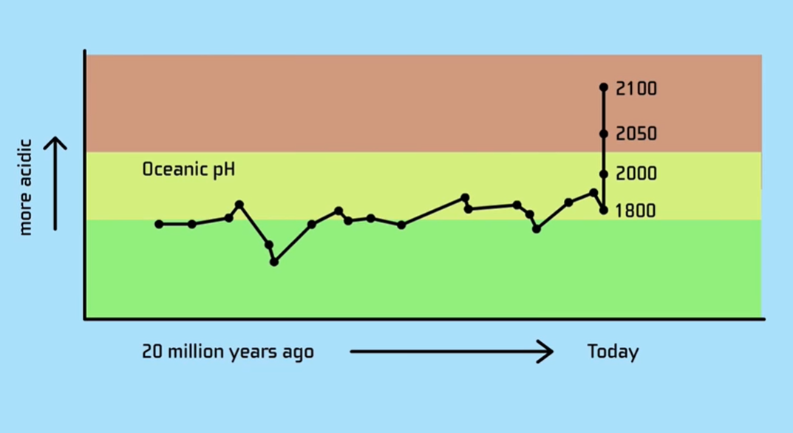
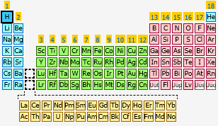
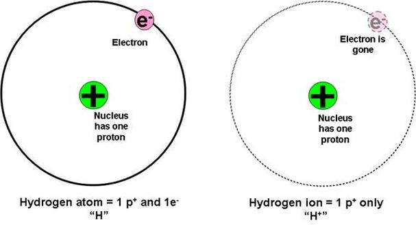
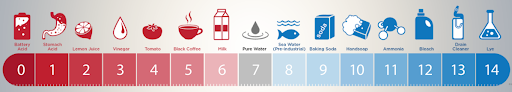
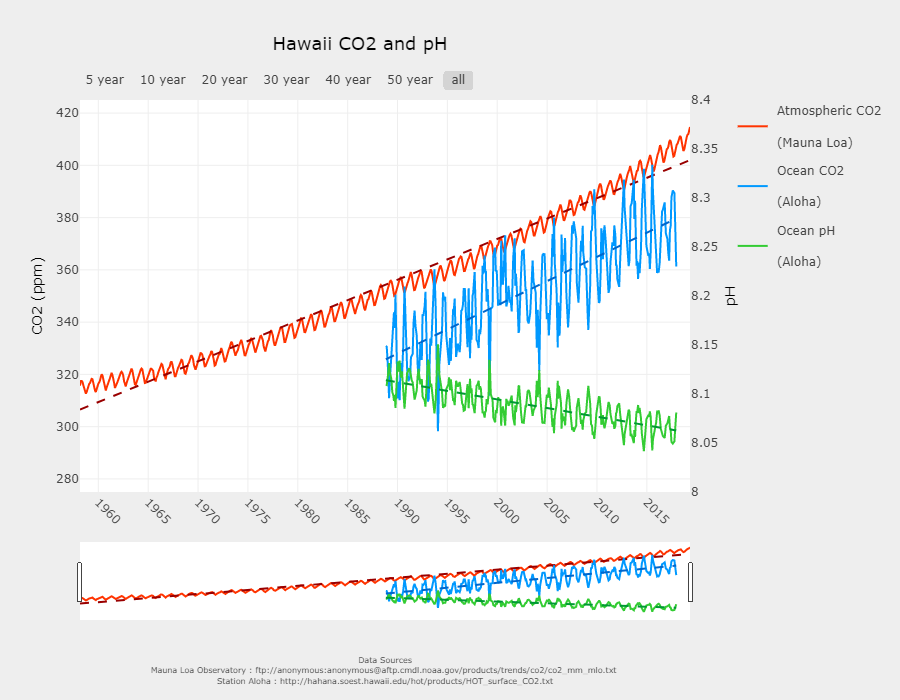
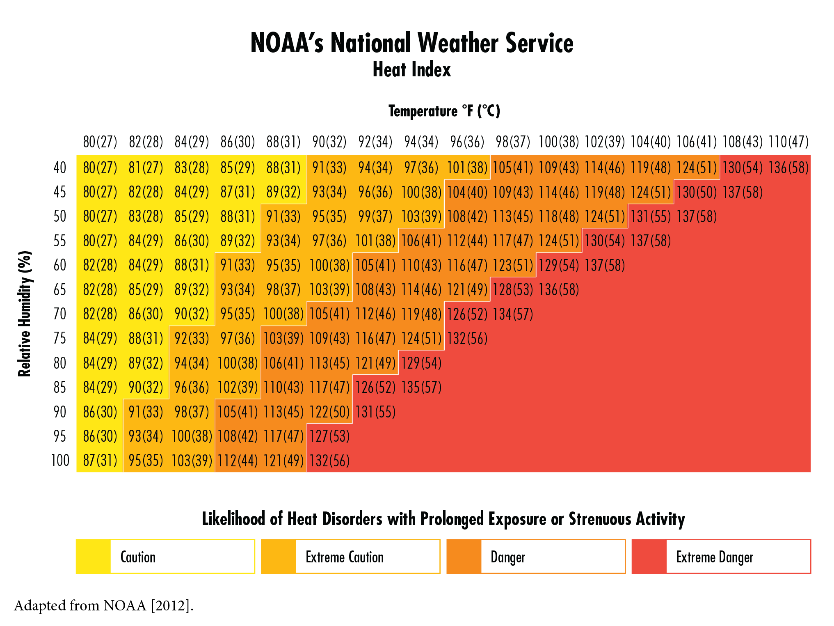

# Why does climate change matter?

Welcome back! We've just discussed the basics of climate change. So? Who cares? Let's review and jump into the impacts that connect you to climate change.

<iframe width="560" height="315" src="https://www.youtube-nocookie.com/embed/ztWHqUFJRTs" frameborder="0" allow="accelerometer; autoplay; clipboard-write; encrypted-media; gyroscope; picture-in-picture" allowfullscreen></iframe>

## Weather impacts

### Extreme weather

What evidence do we have that climate change is impacting extreme weather? Let's watch this next video to learn about attribution science.

<iframe width="560" height="315" src="https://www.youtube-nocookie.com/embed/L4U4H5xLCoM?start=112" frameborder="0" allow="accelerometer; autoplay; clipboard-write; encrypted-media; gyroscope; picture-in-picture" allowfullscreen></iframe>

If you want to better understand these probabilities, watch [this optional video](https://youtu.be/RJmrCw5ztp8) about hundred-year floods (it's really interesting!)

But of course, hurricanes aren’t the only kind of extreme weather climate change influences. Let’s talk about how and why we expect climate change to influence various extreme weather events.

**Heatwaves:** when the Earth gets warmer, it makes sense that we’ll experience that warmer world. Although it’s not as simple as the daily temperature being a few degrees warmer every day, one of the effects we will see is that heat waves (periods of intense heat) will be more frequent, more severe, and longer-lasting. “The National Climate Assessment estimates 20-30 more days over 90 degrees F in most areas by mid-century. A recent study projects that the annual number of days with a heat index above 100 degrees F will double, and days with a heat index above 105 degrees F will triple, nationwide, when compared to the end of the 20th century” ([source](http://www.c2es.org/content/heat-waves-and-climate-change/)). Heatwaves are deadly because they not only cause heat stroke, but they can exacerbate health conditions like asthma, kidney disease, and insomnia. Resilience methods include cooling centers and more efficient power grids for handling the increased load of air conditioning, as well as green roofs, cool pavement, and increased tree cover in cities to keep them cool. More solutions can be found [here](https://www.c2es.org/site/assets/uploads/2017/11/resilience-strategies-for-extreme-heat.pdf).

**Drought:** as water evaporates faster in warmer temperatures, increased drought is one of the most important consequences of climate change. The heat can also disrupt wind patterns that usually bring a region rain, and it can decimate the snowpacks that feed rivers in the first place, introducing drought to areas where it was never a problem before. Drought hurts people all over the world through water shortages as well as crop failures and famines that increase global food insecurity, but we can do our best to address these through better water management and less water-intensive agriculture.

**Wildfires:** wildfires go hand in hand with high temperatures and drought-withered plants, both of which are exacerbated by climate change. Between more fire-prone conditions, and a longer fire season, “For much of the U.S. West, projections show that an average annual 1 degree C temperature increase would increase the median burned area per year as much as 600 percent in some types of forests” ([source](http://www.c2es.org/content/wildfires-and-climate-change/)), worsening the destruction and tragedy that we already observe today. We can try to cope through better management of forests (such as controlled burns to clear fuel), more fire-resistant design in where and how we build our houses and spending more resources on firefighting and prevention.

**Extreme precipitation:** If it’s true that climate change causes drought, how can it be true that it also causes flooding and other extreme precipitation events too? Well, when all that water evaporates from areas in drought, it doesn’t disappear. Instead, it sticks around in the air, which is now warmer and can hold more water. And when all that extra water comes down, it causes flooding, devastation, and loss of life. To make matters worse, because it now comes down in occasional larger storms instead of more frequent smaller storms, the soil gets saturated and the excess water drains away before the community can benefit from it. Thus, even areas that experience extreme precipitation can still suffer from drought.

**Hurricanes:** Increased precipitation under climate change will also mean increased rainfall from hurricanes. But hurricanes won’t just grow more intense due to heavier rainfall. Heat is the energy that drives hurricanes, so a warmer Earth means higher wind speeds, longer hurricane season, and wider areas vulnerable to hurricanes. Any given storm is likely to be stronger, and what might have been just a tropical depression is more likely to be a full-fledged hurricane. They’re also likely to move more slowly and thus dump more rain over any given area. Lastly, higher sea levels make storm surges more severe. The best ways to adapt include elevating buildings and preparing with boarded windows when storms approach, as well as constructing storm buffers like wetlands and seawalls to absorb storm surges.

**Blizzards:** This is perhaps the most counterintuitive effect of climate change, but as warmer air contains more water, that means that when the air does cool, it has a lot more snow to dump. And although average temperatures might be going up, cold weather isn’t going away any time soon. Resilience methods for blizzards include emergency stores of non-perishable goods, sturdy roofs, and burying power lines to prevent outages from icefalls.

These extreme weather events ravage the news, too. Let's read through this article from Inside Climate News to learn about a disturbing current event from the time of writing this course.

- [A siege of 80 large, uncontained wildfires sweeps the hot, dry West](https://insideclimatenews.org/news/09092020/wildfires-american-west-climate?utm_source=InsideClimate+News&utm_campaign=b298d46663-&utm_medium=email&utm_term=0_29c928ffb5-b298d46663-327969729), Inside Climate News article

**Q: What's on the news right now? Find a recent event (news article, broadcast video, research paper, etc.) that occurred as a result of climate change and summarize below.**

<textarea placeholder="Preview submission area. Answers are not saved."></textarea>

### Everyday weather

But what about the weather that’s not extreme, the kind we see from day to day? Climate change impacts that, too, of course. Average global temperatures will rise. But that doesn’t mean that the weather will get warmer everywhere.

Watch this video to learn about the jet stream disruption.

<iframe width="560" height="315" src="https://www.youtube-nocookie.com/embed/yQliow4ghtU" frameborder="0" allow="accelerometer; autoplay; clipboard-write; encrypted-media; gyroscope; picture-in-picture" allowfullscreen></iframe>

Next, let's watch this video about Gulf stream disruption. Alternatively, you can read [this article.](https://blogs.ei.columbia.edu/2020/01/02/climate-change-gulf-stream/#:~:text=The%20Gulf%20Stream%20gets%20stronger,slowly%20and%20carry%20less%20water.) Despite their similar names, Gulf steam disruption is unrelated to jet stream disruption!

<iframe width="560" height="315" src="https://www.youtube-nocookie.com/embed/UuGrBhK2c7U" frameborder="0" allow="accelerometer; autoplay; clipboard-write; encrypted-media; gyroscope; picture-in-picture" allowfullscreen></iframe>

### Water shortages

Are you wondering how increased rain and increased drought can coexist? This next video is a good introduction to how climate change can cause water shortages. A deeper dive can be found in this [optional video](https://youtu.be/vB68xvRb2T4).

<iframe width="560" height="315" src="https://www.youtube-nocookie.com/embed/IvhteDjrZU4" frameborder="0" allow="accelerometer; autoplay; clipboard-write; encrypted-media; gyroscope; picture-in-picture" allowfullscreen></iframe>

Remember that bit about migration and war that came up in the first video—it resurfaces in later sections in the course, influencing food security, health, and equity.

**Q: Review and reflect. How will climate change likely affect weather in your region? Which kinds of extreme weather do you think will increase in frequency and/or intensity in your area? Which kinds, if any, will likely decrease in frequency and/or intensity? How will your everyday weather in your area be affected? How should your community adapt in the face of these changes?**

<textarea placeholder="Preview submission area. Answers are not saved."></textarea>

## Deforestation

Our planet’s forests are some of the most valuable resources we have, they provide us with clear air, construction material, and a source of food. Even more importantly, it is one of the most important defenses against climate change!

Who cares if we cut down all the trees? Sure, it sounds like a bad idea, but what would _really_ happen to a city without trees? Let's watch this TED-Ed video to find out.

<iframe width="560" height="315" src="https://www.youtube-nocookie.com/embed/zarll9bx6FI" frameborder="0" allow="accelerometer; autoplay; clipboard-write; encrypted-media; gyroscope; picture-in-picture" allowfullscreen></iframe>

### Habitat loss and habitat fragmentation

If you ever thought that deforestation is unrelated to your current lives, let’s take a look at how deforestation played a role in causing pandemics and epidemics that have changed the course of society.

Covid-19, SARs, and Ebola are three highly infectious diseases that plague the human species since 2002, and all three leaped to humans from wild animals that lived in dense tropical forests. As we slash and burn the forest habitat to create land for agriculture, the chances of us coming in contact with wildlife that carries infectious microbes increases. Watch this animated video from one of our team members to learn more.

<iframe width="560" height="315" src="https://www.youtube-nocookie.com/embed/UmOasRlMuXs" frameborder="0" allow="accelerometer; autoplay; clipboard-write; encrypted-media; gyroscope; picture-in-picture" allowfullscreen></iframe>

The occurrence of Covid-19 is catastrophic, however, this can pivot our attention to the consequences of exploring our natural world, as well as the huge payoff we can achieve once we change our actions.

### Wildfires

Although wildfires are natural occurrences within some forest ecosystems, fire seasons are becoming increasingly more extreme and widespread. The continuously hot and dry weather caused by climate change creates favorable conditions for more frequent and higher intensity wildfire. Fires, either ignited by humans or lightning are much more likely to burn over larger areas and at hotter departures with drier conditions. Forests degraded by logging and disease, and fragmented by deforestation are also more susceptible to fire ([source](https://www.globalforestwatch.org/topics/fires/#slides/1)).

Rainforests like the Amazons are especially affected, it has been a year since the world has seen the shocking images of the burning forest. But since then, the situation has not been relieved, it is predicted that 2020 would be an even more devastating year for the Amazons as well as the indigenous people who call it home.

<iframe width="560" height="315" src="https://www.youtube-nocookie.com/embed/B5gv4bka5Qg" frameborder="0" allow="accelerometer; autoplay; clipboard-write; encrypted-media; gyroscope; picture-in-picture" allowfullscreen></iframe>

Wildfires release pollutants such as carbon dioxide into the atmosphere, exacerbating global warming, and causing irreparably damaging forests ecosystems since more than half the world's land-based plants and animals live in and around forests. In addition, the resulting smoke and other emissions containing pollutants can travel miles, creating significant public health crises. Uncontrolled wildfires also cause billions of dollars in economic damage each year as property and natural tourist attractions are destroyed and economies are crippled by evacuations ([source](https://www.globalforestwatch.org/topics/fires/#slides/2)).

Let's visit the Global Forest Watch and examine recent trends in fire alerts. Pick a region to investigate!

- [Global Forest Watch](https://gfw.global/3n14vJA)

**Q: What did you learn about your region? Are there are trends you can pick out? Where are the forests located? How does your location stack up with other areas?**

<textarea placeholder="Preview submission area. Answers are not saved."></textarea>

### Ice sheets and glaciology

There’s a lot of ice in our poles, and it’s melting fast. But how much would the melt really affect us? Just how much water is held in the ice caps? Watch this quick video as an intro to this segment on how climate change affects our cryosphere.

<iframe width="560" height="315" src="https://www.youtube-nocookie.com/embed/b6CPsGanO_U" frameborder="0" allow="accelerometer; autoplay; clipboard-write; encrypted-media; gyroscope; picture-in-picture" allowfullscreen></iframe>

There are two main types of ice: ice that forms in the ocean, or sea ice, and ice that forms on land, such as glaciers, icebergs, ice sheets, etc.

Glaciers form where there is more **deposition**, or snow deposits resulting in ice mass gain, than **ablation**, or loss in ice mass due to factors like melting and sublimation, or ice calving.

### Why are the glaciers and ice important?

Sea ice, or ice that forms in the ocean, impacts climate in two main ways: reflecting sunlight back into space, and changing the surrounding salt concentration when it forms.

- [How does sea ice affect global climate?](https://oceanservice.noaa.gov/facts/sea-ice-climate.html), NOAA

This concentration change is one of the driving components of the [global ocean conveyor belt](https://gpm.nasa.gov/education/videos/thermohaline-circulation-great-ocean-conveyor-belt). This video is a fairly detailed rendition of the conveyor belt, also known as the **thermohaline circulation (THC)**. The sea ice article also briefly describes the conveyor belt [here](https://oceanservice.noaa.gov/facts/conveyor.html).

Thermo (heat) haline (salinity, or salt) circulation describes the two factors which drive the current that circulates water around the globe, distributing nutrients and heat worldwide. Next, let's check out this article from NASA about the long-term sea level rise from melting ice in Greenland.

- [Study Predicts More Long-Term Sea Level Rise from Greenland Ice](https://www.nasa.gov/feature/goddard/2019/study-predicts-more-long-term-sea-level-rise-from-greenland-ice), NASA

If emissions stabilize by the end of the century, based on IceBridge’s glacial mass model we lose 26-57% of the total mass currently. However, if they continue to increase, we could lose up to 99% of glacial mass by 3000. If they decrease, we can limit the losses to only 8-25% - still a large number, but much more manageable.

The accompanying video shows both the speed of the ice sheets and gives a more understandable look at what exposing bedrock will look like as the massive ice sheets covering Greenland give way. If you’re interested in IceBridge, [here’s ](https://www.nasa.gov/feature/goddard/2019/nasa-s-operation-icebridge-completes-eleven-years-of-polar-surveys)more on its history.

<iframe width="560" height="315" src="https://www.youtube-nocookie.com/embed/LtpD-bAFQoc" frameborder="0" allow="accelerometer; autoplay; clipboard-write; encrypted-media; gyroscope; picture-in-picture" allowfullscreen></iframe>

The main problem with this is all that ice lost goes into the ocean, which we will cover in the next section. NASA has put together a few simple articles that do a pretty good job of describing major factors that impact sea level. Let's first take a look at the tabs under Global Sea Level.

- [Understanding Sea Level](https://sealevel.nasa.gov/understanding-sea-level/overview), NASA

Now take a look at the tabs under Regional Sea Level.

**Q: How do they compare to Global Sea Level? Do you see one as more important?**

<textarea placeholder="Preview submission area. Answers are not saved."></textarea>

Lastly, take a look at the By The Numbers and the Key Indicators tab. By The Numbers provides a nice numerical breakdown of the changes happening, and the Key Indicators provides a more graphical view.

### Current events in the cryosphere

The Larsen Ice Shelf is a long shelf on the east coast of the Antarctic Peninsula, commonly divided into four segments: A, B, C, and D. Let's read about some major melts.

- Recent major melts [(Larsen Ice Shelf A, B, C, and D)](https://earthobservatory.nasa.gov/world-of-change/LarsenB), NASA

**Q: Consider why their breakaways are significant to the overall landmass. Do you think these melts were caused by climate change? How they will affect the future of the cryosphere?**

<textarea placeholder="Preview submission area. Answers are not saved."></textarea>

Next, let's check out the Global Ice Viewer from NASA to explore the ablation data and pictures.

- [Global Ice Viewer](https://climate.nasa.gov/interactives/global-ice-viewer/#/), NASA

Look at the ice flow map under the Antarctic tab. Pick an area of fast flow, and look at a map of the ice shelves in the corresponding area.

**Q: How would you describe the connection between flow and ice shelves?**

<textarea placeholder="Preview submission area. Answers are not saved."></textarea>

Optionally, pick a shelf to research and look into whether the shelf is still stable today.

The Greenland Ice Sheet is one of two ice sheets left in the world: the other is the Antarctic Ice Sheet. An **ice sheet** is defined as a mass of glacial ice that covers surrounding terrain and is greater than 50,000 km² (19,000 sq mi). Here's another article from Nasa that dives into Greenland's melt.

- [Greenland's rapid melt will mean more flooding](https://sealevel.nasa.gov/news/178/greenlands-rapid-melt-will-mean-more-flooding), NASA

If you are interested, the third ice sheet that existed up until 20,000 years ago was the Laurentide Ice Sheet. It covered most of northern North America (i.e. Canada and the northern US), advancing and retreating multiple times during the Quaternary glacial epochs.

The Greenland Ice Sheet lost 3.8 trillion tons of ice between 1992 and 2018. Based on this, it will contribute to a gain of 3-5 inches in sea level by 2100.

Finally, here's a bonus for the glacially inclined: [Photo glossary of glacial features!](https://www.nps.gov/subjects/geology/glacial-landforms.htm)

## Rising sea levels

So where is all that ice going? Well… into the ocean. Let's read the following article from the National Geographic, which encompasses the many impacts of sea level rise, including loss of habitat, erosion, flooding, and more.

- [Sea level rise, facts and information](https://www.nationalgeographic.com/environment/global-warming/sea-level-rise/), National Geographic article

Next, let's watch this video from Our Changing Climate, which explains nuisance flooding and provides a nice visualization of the data trends.

<iframe style="position: absolute; top: 0; left: 0; width: 100%; height: 100%;" src="https://www.youtube-nocookie.com/embed/_xKKs0hGPxo" frameborder="0" allow="accelerometer; autoplay; clipboard-write; encrypted-media; gyroscope; picture-in-picture" allowfullscreen></iframe>

Many cities are at risk, and especially the ones near the coast. Let's visit Google Earth's models of sea level rise in prominent cities at different temperature levels.

- [Global cities at risk from sea level rise](https://sealevel.climatecentral.org/maps/google-earth-video-global-cities-at-risk-from-sea-level-rise), Google Earth

**Q: What did you notice from the Google Earth videos? What surprised you? Which temperature increase would you rather experience?**

<textarea placeholder="Preview submission area. Answers are not saved."></textarea>

## Ocean acidification

Let’s start off with a short review. Remember when you learned what the **carbon cycle** is? It’s the movement of carbon between the air, land, and water, as a result of plants using carbon during photosynthesis to grow and living things making carbon during respiration to make energy.

Usually, this cycle keeps the levels of carbon steady in the air, the water, and in plants. But since the burning of fossil fuels and cutting down of forests started, more and more carbon dioxide (CO2) is being pumped into the atmosphere. What do you think this does to the ocean? Do you think that having more carbon dioxide in the air can have large repercussions for the fish in the ocean? How do you think that happens? Make a prediction for yourself.

<figcaption>The change in the ocean’s pH over time.</figcaption>

Before we talk about how organisms in the ocean are affected by changes in the carbon cycle, we need to talk about how the ocean water is affected. In the picture above, the line is tracking changes in something called “oceanic pH”. This is the measure of how **acidic** or alkaline the ocean water is. The acidity is **inversely related** to the concentration of **hydrogen ions** in the water. In the water, these are individual atoms of the first element in the periodic table, hydrogen that have lost their only electron.

<figcaption><a href="http://www.knowledgedoor.com/2/elements_handbook/hydrogen.html" target="_blank" rel="noopener">Hydrogen</a>, image from knowledgedoor.com</figcaption>

<figcaption>Image from <a href="https://hydrogen-jessbennett.weebly.com/ions-and-chemical-bonding.html" target="_blank" rel="noopener">Ions and Chemical Bonding</a></figcaption>

The “inverse relationship” means that as the number of hydrogen ions increases, the pH decreases. pH is unitless but has a **logarithmic** scale from 0 to 14, with pure water in the middle with a neutral pH of 7. “Logarithmic” means that with each step up or down the scale, the concentration of hydrogen ions changes by a factor of 10. So, if you have a cup of water with a pH of 7, another cup of water with a pH of 6 will be 10 times as acidic, and a cup of liquid with a pH of 5 is 100 times as acidic.

The smaller the numbers get on the scale, the more acidic the substance is, like vinegar or lemon juice. The higher up you go, the more alkaline the substance, like baking soda or bleach. Seawater is naturally more alkaline, with a pH around 8.16. As we can see from the graphic, over time, the oceanic pH has become more acidic, meaning the pH is getting smaller and smaller.

<figcaption><a href="https://noaa.maps.arcgis.com/apps/MapSeries/index.html?appid=adec7620009d439c85109ab9aa1ea227" target="_blank" rel="noopener">Measuring Changes in Ocean pH</a>, image from the NOAA Ocean Acidification site.</figcaption>

But what does this have to do with the carbon cycle? It is confusing that while the amount of carbon dioxide in the atmosphere is increasing, the ocean’s pH is decreasing instead. But the ocean’s pH depends on the amount of CO2 in the ocean, and this ultimately is affected by the amount of CO2 in the atmosphere. To understand this, we’re going to look at some data from [this online activity by NOAA](https://noaa.maps.arcgis.com/apps/MapSeries/index.html?appid=adec7620009d439c85109ab9aa1ea227) on ocean acidification (and, by the way, if you are interested in learning more about this, there are plenty more activities there to try). Take a look at the following graph of measurements scientists have taken in Hawaii since the 1960s. Make sure to look at the legend so you understand what the graph says.

<figcaption>Graph of atmospheric CO2, ocean CO2, and ocean pH over time in Hawaii</figcaption>

**Q: Pick the right conclusions to make about this graph.**

<textarea placeholder="Preview submission area. Answers are not saved."></textarea>

1. **On this graph, the red line shows an [increase / decrease] in atmospheric CO2 over time.**
2. **The atmospheric and oceanic CO2 follow [the same / different] trends over time.**
3. **As the atmospheric CO2 changes, the oceanic pH follows [the same / a different] trend.**

Here, we see that as more carbon dioxide is present in the atmosphere, the ocean becomes more acidic. This means the pH is increasing, and the concentration of hydrogen ions is increasing. We can see these changes over time at [this next website](https://www.nnvl.noaa.gov/view/globaldata.html#ACID) by NOAA.

- [Ocean Acidification Visualizer](https://www.nnvl.noaa.gov/view/globaldata.html#ACID), NOAA

Click the link and find the slider that shows the change over time. Notice that the animation starts in 1861. What color are most of the oceans when you first open the website? Move the slider to the year 2030, then to 2070. What change have you noticed? Finally, move the slider all the way to the right to the year 2100. What color is almost missing now?

The dark blue at the beginning around the 1800s meant the ocean around then was mostly basic, with a pH around 8. However, by the year 2100, almost all the oceans have a pH of 7.7. So, how does the ocean being more acidic affect the animals living there? Watch this video by the Alliance for Climate Education, which explains ocean acidification's impact.

<iframe width="560" height="315" src="https://www.youtube-nocookie.com/embed/6SMWGV-DBnk" frameborder="0" allow="accelerometer; autoplay; clipboard-write; encrypted-media; gyroscope; picture-in-picture" allowfullscreen></iframe>

One mineral that shell-building animals need is **aragonite**. But as the ocean becomes more acidic, it’s harder and harder for these animals to find aragonite to make their shells big and strong. We can see trends in how saturated aragonite is in seawater and make predictions for how saturated it will be in the future with another NOAA visualizer.

- [Aragonite Visualizer](https://www.nnvl.noaa.gov/view/globaldata.html#ARAG), NOAA

**Q: When you first open the site, what color is the ocean mainly? What does this mean? When you move the slider to some time between 2020 and 2030, what changes have you noticed? When you move the slider all the way to the right to the year 2100, what color is almost gone now? What color do you see more now? What does that mean for the animals that require aragonite to make their shells?**

<textarea placeholder="Preview submission area. Answers are not saved."></textarea>

Here, we can see that the more acidic oceans are, the harder it is for animals to survive—and, as the video stated, if the oceans are acidic enough their shells will begin to dissolve in the acidic oceans instead of growing stronger. This makes it harder for fish that eat these shelled animals to find food, which makes it harder for people who rely on these fish for their livelihoods to survive.

One example of an animal crucial to the survival of marine animals and the people that depend on them to buy food to put on the table is the humble coral reef. These reefs may look like pretty rocks, but in reality, they are all living organisms that support 25% of all marine organisms. They use chemicals in the water to grow larger and make more habitats for other fish. However, when the water is more acidic, it is harder for them to grow, threatening the populations of countless fish and the livelihoods of millions of people who rely on them. A lot of other factors, like warming ocean temperatures, overfishing, and ocean pollution are threatening these corals, so adding on ocean acidification is not helping conservation efforts. If you are interested in learning more about coral reefs, the threats they face, and their importance to the ocean ecosystem, check out [this article](https://interactive.carbonbrief.org/can-great-barrier-reef-survive-climate-change/) by CarbonBrief.

## Algae blooms

You’ve already learned about a lot of negative impacts of climate change. Here’s another: algae blooms! To learn a bit more about algae blooms, watch this video from the Environmental Working Group and read through this page from NOAA about algae blooms. When reading and watching, it may be helpful to create a two-column chart to sort information about how algae blooms form and what the consequences are.

<iframe width="560" height="315" src="https://www.youtube-nocookie.com/embed/8tZooDsX8Fo" frameborder="0" allow="accelerometer; autoplay; clipboard-write; encrypted-media; gyroscope; picture-in-picture" allowfullscreen></iframe>

- [What is a harmful algal bloom?](https://www.noaa.gov/what-is-harmful-algal-bloom), NOAA article

Before you go on to learn about species extinction, let’s review. Harmful algae blooms occur when colonies of algae and cyanobacteria grow out of control. When this happens, harmful toxins that hurt fish, humans, animals, and the entire system are produced. As the algae decay, they take in oxygen from the surrounding water, discolor the water, and can get into drinking water. We have seen that increased nitrogen and phosphorus in the water leads to more blooms, a lot coming from fertilizers and agricultural products. We are also seeing that increased rainfall and higher temperatures are making these blooms start earlier in the season and last longer.

## Human health

Climate and weather have always played vital roles in human health. Climate influences the flora and fauna (plants and animals) that grow around us and provide sustenance; it determines the way in which we interact with our fellow creatures; and of course, humans thrive in a relatively small set of temperatures that we are lucky to currently encounter here on Earth.

### Heat-related disease

Cardiovascular diseases (disorders of the heart and blood vessels) are the #1 cause of death globally. As temperatures increase, how do you think the incidence and severity of cardiovascular disease might change? Would it even change much?

**Q: Briefly predict what might happen and why that might be the case.**

<textarea placeholder="Preview submission area. Answers are not saved."></textarea>

Now take a look at this [case study published in the Iranian Journal of Public Health.](https://www.ncbi.nlm.nih.gov/pmc/articles/PMC5395536/) What did they conclude about the relationship between climate change and higher temperatures (at least past a certain point)? (Tip: You don’t have to read the body of the paper to figure this out.) If this can be generalized, what are the implications for the future?\*\* \*\*

**Q: What kinds of adaptations and innovations would we need to combat increased cardiovascular disease, at the root or otherwise? This is a pretty big question, so feel free to get creative. Anything goes!**

<textarea placeholder="Preview submission area. Answers are not saved."></textarea>

**Q: What are other examples of conditions you can think of that might be worsened by climate change? Try thinking about how you feel after an exercise session on a hot day.**

<textarea placeholder="Preview submission area. Answers are not saved."></textarea>

After you’ve pondered that for a minute or two, briefly check out the following article.

- [Climate Change and Health](https://www.cambridgepublichealth.org/climate-change/), Cambridge Public Health.

**Humidity** describes the amount of water vapor in the air. Have you ever noticed the "feels like" section on your weather app? While the app says it'll be 76 degrees one day, it also says that it'll _feel like_ 85 degrees instead. This isn't a mistake! High humidity creates a stickier, sweatier environment, making it seem hotter than it really is. The heat index is a more accurate representation of how the weather might feel to us, taking both relative humidity and temperature into account.

Let's watch this next video from the YEARS Project, which explains how humidity makes the heat more deadly.

<iframe width="560" height="315" src="https://www.youtube-nocookie.com/embed/hgdLRECOQI8" frameborder="0" allow="accelerometer; autoplay; clipboard-write; encrypted-media; gyroscope; picture-in-picture" allowfullscreen></iframe>

Think about how you would illustrate the disparate effects of climate change on different types of people. Craft two different profiles of people in different places with different situations

**Q: How can climate change have incredibly wide-ranging effects on those around the world?**

<textarea placeholder="Preview submission area. Answers are not saved."></textarea>

## Food security

Food security is when all people at all times have physical, economic, and social access to sufficient, safe, and nutritious food to lead active and healthy lives ([source](https://www.youtube.com/watch?v=v24wT16OU2w)). If you’d like to learn more, watch the following [optional video](https://www.youtube.com/watch?v=krU01hlCdxo) from the World Economic Forum.

Reflect on all the other impacts of climate change you have learned about so far. Brainstorm ways that this might affect the production and distribution of food, particularly for people who are at the greatest risk of food insecurity. Then read this article from Columbia University's Earth Institute, which explains the impact of climate change on agriculture.

- [How will climate change impact our food?](https://blogs.ei.columbia.edu/2018/07/25/climate-change-food-agriculture/), State of the Planet article

You can also read [this optional article](http://www.fao.org/climatechange/16606-05afe43bd276dae0f7461e8b9003cb79.pdf), which includes potential solutions to these issues.

**Q: Which impacts in the article(s) did you anticipate? Which were new to you? Did you have any ideas that the article did not discuss?**

<textarea placeholder="Preview submission area. Answers are not saved."></textarea>

## Economic impacts

Perhaps one of the most frustrating responses to fighting climate change is the argument that “reducing emissions would require disrupting the economy.” But it’s important to remember that climate change will deeply affect just about every aspect of our lives. And that, of course, includes the economy.

Surely, compared to all the other impacts we’ve gone over so far, the economy should be the least of our worries, you might say. But remember that during recessions, people lose their jobs and healthcare, small businesses struggle, and the impoverished suffer. When the stock market falls, people lose their retirement savings. And while preventing climate change may cause some damage, the economic and human suffering that climate change will bring far outweighs the sacrifices involved in preventing it. Studies find that the impacts of climate change could cost the economy at least $150 trillion over the next hundred years, and possibly as much as $792 trillion ([source](https://www.cbsnews.com/news/climate-change-action-economic-benefit-study-finds/)). Let’s go over where those costs are coming from. Before we start, go over what you’ve learned and make a list of all the ways you think climate change will impact the economy. As you read, add anything new you learn to your list.

### Weather

We’ve all seen the photos of devastation caused by hurricanes and floods and wildfires. These are the obvious economic impacts: people left homeless, businesses forced to close because they can’t afford to repair their buildings, the dollar sums of damage reported on the news. But these aren’t the only impacts. When infrastructure like roads and bridges are destroyed, shipping and transport are disrupted: businesses can’t replenish their stocks and employees can’t travel to work. When one step in a supply chain is taken out, the whole production line grinds to halt. Disasters can also hamper internet connection, locking people and businesses out of the modern information economy.

And it’s not just the extreme weather that’s bad. Studies have found that heat waves and rising temperatures decrease productivity and increase employee absences. The loss of productivity is especially strong for manual labor and construction, which become more dangerous as temperatures increase. However, absenteeism remains strong regardless of the job ([source](https://epic.uchicago.edu/news/hot-temperatures-decrease-worker-productivity-economic-output/)). Whether or not this is linked to heat-related health issues is unknown, but the evidence makes clear that the economy will slow as the globe warms, likely by around \$2 trillion or more ([source](https://journals.sagepub.com/doi/full/10.1177/1010539514568711)).

### Rising sea levels

Rising sea levels will flood and displace coastal cities, where millions of people live and billions of dollars of investment are concentrated. As people are forced to migrate, unemployment, homelessness, and other metrics of poverty will increase. Industries located along the coasts will have to either relocate at great expense or shutter entirely, laying off their workers.

In addition, rising sea levels threaten infrastructure. In many cities, roads, sewer networks, and other essentials will need to be rebuilt and protected at great expense just so they can keep functioning. One potentially unforeseen impact is the drowning of internet cables. Just one foot of sea level rise could plunge 20% of America’s internet infrastructure under water, due to its concentration in coastal cities like New York and Miami. Even the cabling built to be water resistant will likely not survive being permanently submerged. These internet disruptions won’t just affect jobs and businesses, but could throw off everything from traffic lights to flight patterns, which are now online. If you’re interested in learning more about the internet and climate change, you can read [this optional source](https://www.nationalgeographic.com/science/2018/07/news-internet-underwater-sea-level-rise/).

Another form of infrastructure that will be affected is the power grid. One striking example is nuclear power. Nuclear plants need a constant supply of water to maintain their cooling systems, and many draw this water from the ocean. Depending on where you draw the line, between 25 and 40% of power plants are located along the coasts, with this figure potentially rising as high as 66% among new plants. Rising sea levels increase the likelihood of floods and tsunamis that, in the best-case scenario, will temporarily shut down a plant’s power operations and, in the worst-case scenario, can cause meltdowns and other nuclear disasters. As sea levels only continue to rise, we will be forced to remove nuclear materials from flooding sites. Even if we can safely move these radioactive materials and avoid meltdowns, this still leaves us only more dependent on fossil fuels to provide energy. For more information on nuclear power and climate change, you can read [this optional source](https://www.hakaimagazine.com/features/are-coastal-nuclear-power-plants-ready-for-sea-level-rise/).

### Plants and animals

It’s difficult to dispute the threats climate change poses to the natural world. Instead, people argue that we should focus on the interests of people over plants and animals. Such a take, however, ignores just how much of the world is dependent on those species.

As referenced in previous sections, the fishing industry is likely to suffer greatly due to warming, acidifying oceans. Shellfish die as they are unable to build their shells. Schools of fish move towards colder water at the poles, away from the people who depend on them for food. Parasites and diseases expand their ranges. Fish migration and breeding seasons are thrown out of sync. Together, these factors spell a collapse of fisheries around the world. The hundreds of millions of people for whom seafood is a staple of their diet will suffer, but we will also see substantial job loss among the people providing those fish. The industry could lose as much as \$10 billion a year, with many small scale and equatorial fisheries being hurt the hardest ([source](https://www.forbes.com/sites/janetwburns/2016/10/06/global-fisheries-will-lose-10b-a-year-to-climate-change-by-2050/?sh=20c7359e7d65)).

It’s also easy to forget how much of global tourism is built around the natural world. Safaris in Africa, rainforest tours in Costa Rica, America’s national parks, all rely on their biodiversity and natural beauty to draw visitors. Climate change won’t just bring about extinctions. There are also countless jobs that will be lost when species go extinct and habitats collapse. For example, it’s estimated that Florida’s coral reefs alone generate \$1.6 billion of revenue, all of which will vanish if the reefs do ([source](http://www.oas.org/macc/Docs/TourismIssues.doc)). Even non-environmental tourism will be affected, as beaches are submerged and ski resorts lose their snow.

### Food and water shortages

Between water shortages, rising temperatures, extreme weather, changes in insect distributions, and other factors you’ve read about, agriculture is going to become a lot harder under climate change. Farmers, especially family farms without industrial capacity, will struggle, and many will fail. Over a quarter of the world’s population makes their living from farming, and now that livelihood is under serious threat from climate change.

Climate-driven crop failures, when combined with the damage climate change will inflict to fishing and supply chains, will deal a major blow to food security, as discussed above. Food prices will rise. Even those who can afford their next meal may struggle affording much more than that. As more money has to be funnelled to agriculture just to keep people fed, other sectors of the economy will likely shrink, leading to even greater poverty.

### Cause for hope

So are we really caught between a rock and a hard place? We either slow our economy deliberately with carbon prices and environmental regulations, or we let it be ravaged by climate change?

Well, we’ll let you in on a little secret. What you’ve heard about how fighting climate change will slow the economy and cost millions of jobs is (mostly) _not true_. Yes, jobs will be lost in fossil fuel industries and carbon-intensive businesses. But these losses will be balanced out by new jobs in renewable energy, environmental conservation, new infrastructure projects, and more. Research from Canada suggests that these new jobs will likely outnumber the old jobs, with 160,000 jobs being created in Canada alone while only 50,000 in fossil fuel industries will be lost ([source](https://cleanenergycanada.org/report/the-fast-lane-tracking-the-energy-revolution-2019/)). This is because most fossil fuel industries gain their value from minerals in the ground, like oil and coal, while renewables gain their value from human labor and technology. Profits from oil mostly go to whoever has the rights to the reserves, with comparatively few workers to pay salaries to, while renewable energy profits are spread out among a greater number of workers ([source](https://www.cbc.ca/news/business/employment-climate-economy-1.5384311)). Renewable energy prices are getting low enough to compete with fossil fuels: three quarters of US coal infrastructure is now more expensive than using renewable energy ([source](https://www.wri.org/blog/2020/07/economic-benefits-climate-action-us)). And while carbon taxes take money out of the economy, that money can be reinvested right back in as economic stimulus or welfare for the unemployed.

We don’t have to pick between the economy and fighting climate change. From 2005 to 2017, the state of Maryland cut their emissions 38% while still experiencing 18% GDP growth, and DC cut their emissions 33% and saw 21% GDP growth. In total during that time, 41 states plus DC managed to curb their emissions without shrinking their economies, as did the United States on net and twenty other countries. This false dichotomy we’ve been fed is a lie.

So who has been feeding it to us, and why? Well, the answer has two parts.

First, most of the costs of climate change lie in the future, while the costs of preventing it are now. Humans are pretty bad at making rational decisions in these kinds of situations. Even as the first consequences begin to manifest, the worst is yet to come and is still too far off in the future for many people to properly consider.

Second, remember how we said the profits of fossil fuels tend to be highly concentrated? Those people stand to lose a lot from fighting climate change, even as everyone else benefits. They have a lot of riches to throw at our political system to ensure that they don’t lose their cash cows.

The good news? Both of these influences can be countered by your votes!

## Climate change vs. equity

Although climate change affects everyone on Earth, the impoverished and indigenous groups will face even worse impacts than the wealthy. Their situation is worsened by the fact that the overwhelming majority of carbon emissions come from wealthy industrialized nations, which they have no control over.

### The impoverished

First, let's examine some of these dire situations around the world through this article from the New York Times.

- [This Is Inequity at the Boiling Point](https://www.nytimes.com/interactive/2020/08/06/climate/climate-change-inequality-heat.html?campaign_id=9&emc=edit_nn_20200807&instance_id=21067&nl=the-morning&regi_id=131397395&segment_id=35507&te=1&user_id=3d2f5fed6968a2178c756cea957e7729), NYT article

**Q: Pick two of the following locations (Greece, Houston, Nigeria, Guatemala, India, and New York City) and compare them: which challenges do they share, and which are unique?**

<textarea placeholder="Preview submission area. Answers are not saved."></textarea>

Now, read at least the first two sections of this article from BBC that describes the "climate apartheid." as well as this article from CNBC that covers pre-existing health conditions and "green gentrification."

- ['Climate apartheid' between rich and poor looms](https://www.bbc.com/news/world-48755154), BBC article
- [Climate change in the U.S. will hurt poor people the most](https://www.cnbc.com/2018/11/26/climate-change-will-hurt-poor-people-the-most-federal-report.html), CNBC article

The impoverished also cannot afford to move out of areas vulnerable to sea level rise and flooding. Who is going to buy a house that will be underwater in ten years? As a result, those in poverty remain trapped as the waters rise.

If you're interested, here are a few additional resources:

- [Higher poverty neighborhoods are warmer and wealthier neighborhoods are cooler](https://time.com/3457668/climate-change-poor-neighborhoods/)
- [A deep dive into 'green gentrification'](https://www.wired.com/story/climate-change-will-force-the-poor-from-their-homes/)

### Migration

_Note: if you are a teacher and you do not have the time for this full section, you can have your students watch [this video](https://youtu.be/nIlMHFwC1MM) instead. However, we recommend the sequence below in the strongest possible terms. It is difficult to convey both the number of people climate migration will affect, but it is even more difficult to also convey the trauma and hardship that migration causes to just one family. We have done our best to communicate these two extremes with the following section._

Let's read the first three sections of this report from Brookings, though feel free to read the full article if you'd like. While reading, take notes every time it talks about a number of people being displaced, either by one specific hurricane or by climate change as a whole.

_Content warning: the article below includes descriptions of migration that some students might find triggering. If that’s the case, you are exempt from this reading._

Now, let's check out this article from the New York Times (which is also available as audio) and read the introduction, stopping when you reach the interactive model, which is 9:20 in the audio file. Once again, while reading or listening, take notes every time you are given a statistic or number of people being displaced.

- [The Great Climate Migration Has Begun](https://www.nytimes.com/interactive/2020/07/23/magazine/climate-migration.html), NYT article

The rest of the article is optional, although we strongly recommend the section between “II: How climate moves people” and “One afternoon last summer,” as well as the final section starting from “There is no more natural and fundamental adaptation to a changing climate.”

**Q: Now, look back at all the numbers you have written down. Behind each one is a story just like you encountered in the New York Times article. Take a moment to reflect and to appreciate the extent and scale of what you have read about.**

<textarea placeholder="Preview submission area. Answers are not saved."></textarea>

### Indigenous peoples and the global South

Some of the most vulnerable to the effects of climate change are the indigenous populations of the world. We’ll first look at the native peoples of the Pacific Islanders as a case study.

You’ve probably heard about how sea level rise is threatening to submerge entire islands in the Pacific, but this article from Science Alert discusses how the real threat is the contamination of water supplies.

- [There's a Climate Threat Facing Pacific Islands](https://www.sciencealert.com/pacific-islanders-are-in-a-climate-crisis-as-rising-sea-levels-threaten-water), Science Alert article

And that isn’t the only issue affecting the islands. As Penehuro Lefale makes clear, “Ocean acidification poses a serious threat to ocean ecosystems, and could have profound impacts on the food security, economy, and culture of communities in the Pacific Islands” ([source](https://www.oaalliance.org/2018/03/20/ocean-acidification-and-pacific-islands/)).

In addition, according to the United Nations, “The impact that climate change is having and will have on the tourism industry [in the Pacific islands] is undeniable. Coral bleaching [due to ocean acidification], mangrove forest inundation, and immersion of turtle nests and sea bird habitats all threaten major assets drawing visitors to [these islands]. Tourists are also discouraged from travelling to [Pacific islands] for fear of yet another violent and life-threatening storm. And as valuable coastland is lost to sea level rise, the resorts and hotels that often occupy that prime real estate will be all the more vulnerable to storm surges and other extreme weather events. If the tourism industry contracts, [Pacific island] economies will suffer devastating losses.” ([source](https://sustainabledevelopment.un.org/content/documents/2173emerging%20issues%20of%20sids.pdf))

Lastly, according to the Climate Reality Project, “For Pacific island nations, hurricanes (or as they’re known in the region, tropical cyclones) are already a very real threat. In 2015, Tropical Cyclone Pam hit the Republic of Vanuatu and devastated the nation. It’s considered one of the worst disasters in the country’s history and damages cost the equivalent of 64 percent of the country’s 2016 GDP. This isn’t supposed to happen. As Kiribati’s then-President Anote Tong said in 2015, “When you're on the equator, it's supposed to be in the doldrums. We're not supposed to get the cyclones. We create them, and then we send them either north or south. But they aren't supposed to come back. But for the first time, at the beginning of this year, the Cyclone Pam, which destroyed Vanuatu, and in the process, the very edges of it actually touched our two southernmost islands.” Many small island nations have limited capacity to respond to and recover from natural disasters like this. As hurricanes are projected to become more intense due to climate change, Pacific island nations will be especially vulnerable to their wrath.“ ([source](https://climaterealityproject.org/blog/trouble-paradise-how-does-climate-change-affect-pacific-island-nations))

However, as climate change poses such an existential threat to the Pacific islands, they have been some of the best innovators of ways to protect themselves and their environments from it. Some of their methods include climate-smart agriculture (adaptations that boost productivity while decreasing emissions and adapting to climate change, such as using organic fertilizer, raising garden beds to avoid saltwater intrusion, and diversifying crops); protected areas such as green buffers that prevent runoff and water pollution, or marine areas where fishing is seasonally or permanently closed in order to protect coral reefs; and preserving mangrove forests that form a natural barrier against erosion, floods, and storm surges ([source](https://cop23.com.fj/papuanewguinea/)). However, all of these efforts are limited by a lack of financial resources, ‘brain drain’ (when talented and educated individuals leave the country), as well as by geographic isolation that makes it difficult, slow, and expensive to get ahold of necessary materials.

If you want to learn more about threats facing the Pacific islands and their peoples, and the solutions they are addressing to tackle them, you can look at the following optional sources. [This website](https://cop23.com.fj/fiji-and-the-pacific/pacific-islands/), mentioned above, includes more background as well as breakdowns of issues and adaptations by country. The [UN's report on Emerging Issues for Small Island Developing States](https://sustainabledevelopment.un.org/content/documents/2173emerging%20issues%20of%20sids.pdf) as well as [this World Bank report](https://www.worldbank.org/content/dam/Worldbank/document/EAP/Pacific%20Islands/climate-change-pacific.pdf) (page 9 in particular) both detail additional issues affecting the Pacific islands, many of which concern climate change. And [this paper](https://www.frontiersin.org/articles/10.3389/fmars.2019.00289/full) describes many methods of adaptation adopted by Pacific peoples.

Of course, the Pacific islands are not the only people threatened by climate change. Read this [report](https://www.un.org/en/events/indigenousday/pdf/Backgrounder_ClimateChange_FINAL.pdf) about the impacts of climate change on many different peoples from all over the world and how they are adapting.

**Activity: Pick an indigenous people or region of indigenous peoples, either from the above report or from anywhere in the world, to research further. Describe at least three specific ways that climate change threatens the survival, health, livelihoods, culture, or other aspects of the lives of the people you have chosen.**

<textarea placeholder="Preview submission area. Answers are not saved."></textarea>
